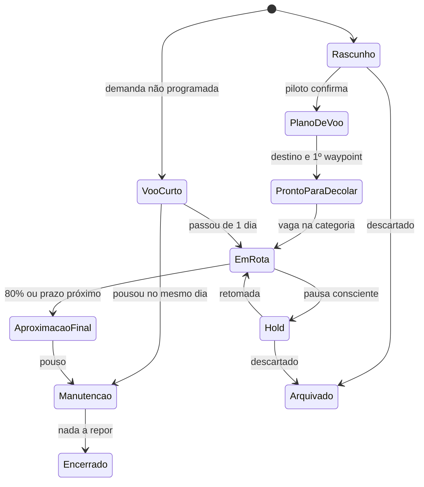
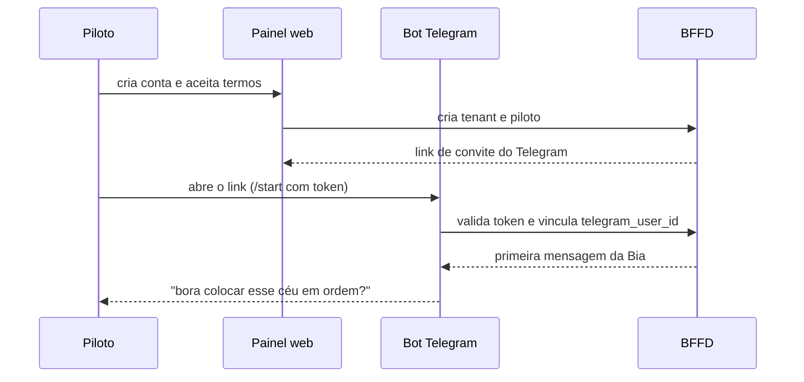
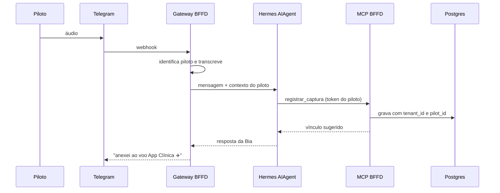
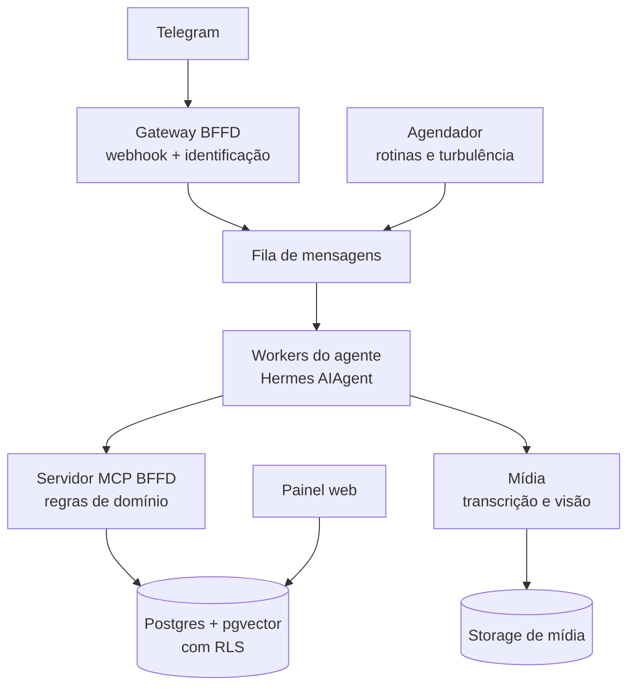
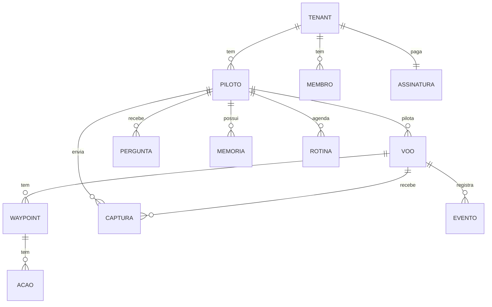

# BFFD — PRD

Sep 24, 2026 · @Sergio

## 1. Resumo e objetivos

O BFFD (Bring the Flights to Final Destination) é um SaaS multi-tenant que ajuda pessoas com TDAH a concluir projetos. Cada usuário conversa com a agente Bia Torres pelo Telegram, que captura, organiza e conduz seus projetos ("voos") até o pouso. Este PRD detalha o [Projeto Conceitual](https://claude.ai/code/artifact/5603a2c8-25f8-4b54-925c-fc508af39d50) e o amplia para múltiplos usuários.

Toda a orientação da Bia segue o método *Getting Things Done* (GTD), de David Allen, adaptado para TDAH. Quando uma regra do GTD conflitar com uma regra do BFFD (por exemplo, o limite de voos ativos), prevalece a regra do BFFD.

### Objetivos do produto

1. Aumentar a taxa de projetos concluídos por usuário: pelo menos 2 pousos por trimestre após 3 meses de uso.
2. Reduzir o atrito de captura a menos de 10 segundos por item, por texto, áudio ou imagem.
3. Manter o usuário engajado sem culpa: mais de 60% dos briefings com resposta ou ação iniciada.
4. Operar com segurança vários usuários, com isolamento total de dados entre contas.

### O que muda em relação ao projeto conceitual

| Tema | Projeto conceitual | PRD |
| --- | --- | --- |
| Usuários | Um único usuário | Multi-tenant: várias contas, cada uma com um ou mais pilotos |
| Agente | Uma instância do Hermes | Integração do Hermes com isolamento por tenant |
| Dados | Base única | Isolamento por tenant com Row Level Security |
| Configuração | Fixa no código | Por conta: limites, horários, limiares de turbulência |
| Cobrança | Não se aplica | Planos e limites de uso por conta |
| Fora do escopo | Equipes e multiusuário | Continua fora: colaboração em um mesmo voo entre pilotos |

### Não objetivos

- Substituir acompanhamento médico ou psicológico.
- Gestão de projetos corporativa (Gantt, alocação de recursos, controle de horas).
- Colaboração de vários pilotos no mesmo voo nesta versão.
- Execução autônoma de tarefas do projeto pelo agente.

## 2. Personas e jornadas

O produto atende três papéis: o piloto (quem usa no dia a dia), o administrador da conta e o operador da plataforma.

| Persona | Quem é | Principal necessidade |
| --- | --- | --- |
| Piloto | Adulto com TDAH, com vários projetos pessoais e profissionais em paralelo | Capturar sem esforço e ser conduzido até concluir |
| Administrador da conta | O próprio piloto (conta individual) ou um responsável (conta família ou clínica) | Configurar plano, pilotos, preferências e cobrança |
| Operador da plataforma | Equipe do BFFD | Monitorar saúde, custos, suporte e segurança dos tenants |

### Jornadas principais

**J1. Primeiro voo (onboarding).** O piloto cria a conta no site, vincula o Telegram por um link de convite e recebe a primeira mensagem da Bia. Em até 10 minutos, faz a "varredura completa" por áudio e sai com pelo menos um voo em preparação.

**J2. Captura no meio do dia.** O piloto manda um áudio de 20 segundos sobre uma ideia. A Bia transcreve, reconhece que é do voo "App Clínica", anexa e confirma em uma linha.

**J3. Tráfego não identificado.** Numa conversa, o piloto diz que quer montar uma loja online. A Bia pergunta se é um novo voo e de qual categoria, cria o rascunho e, nos dias seguintes, completa o plano de voo com uma pergunta por vez.

**J4. Dia de voo.** Às 9h chega o briefing com um voo e uma próxima ação. Às 14h, o check-in. Às 19h, o debriefing. Uma demanda urgente vira voo curto e pousa no mesmo dia.

**J5. Aproximação final e pouso.** O voo passa de 80% dos waypoints. A Bia bloqueia ideias novas, gera o checklist de pouso e, após o pouso, conduz a manutenção.

**J6. Turbulência e reentrada.** O piloto some por 5 dias. A Bia entra em turbulência moderada, suspende cobranças e, quando ele volta, recebe-o com um resumo de onde cada voo parou.

**J7. Administração da conta.** O administrador troca de plano, ajusta horários das rotinas ou exporta os dados pelo painel web.

## 3. Regras de negócio

As regras abaixo valem por piloto e são os valores padrão; os campos marcados como configuráveis podem ser alterados por conta.

### Estágios do voo

| ID | Regra | Valor padrão | Configurável |
| --- | --- | --- | --- |
| RN01 | Voos ativos (Em rota + Aproximação final) por categoria | 2 profissionais, 1 pessoal | Sim |
| RN02 | Voos em preparação e em hold | Ilimitados | Não |
| RN03 | Duração máxima de um voo curto | 1 dia | Não |
| RN04 | Voos curtos por dia | Até 2 | Sim |
| RN05 | Voo curto não pousado no mesmo dia | Converte em Em rota automaticamente | Não |
| RN06 | Entrada em aproximação final | 80% dos waypoints concluídos ou prazo em até 7 dias | Sim |
| RN07 | Tempo em manutenção | Sem limite | Não |
| RN08 | Promoção para Em rota | Só com vaga na categoria; senão, o piloto escolhe qual voo vai para hold | Não |
| RN09 | Captura sem projeto | Nunca é descartada; fica na caixa de entrada | Não |
| RN10 | Perguntas da Bia | No máximo 1 pergunta de definição por interação | Não |

### Rotinas

| ID | Rotina | Horário padrão | Dias |
| --- | --- | --- | --- |
| RN11 | Briefing | 09:00 | Dias úteis |
| RN12 | Check-in | 14:00 | Dias úteis |
| RN13 | Debriefing | 19:00 | Dias úteis |
| RN14 | Revisão semanal | Sexta, 17:00 | Semanal |
| RN15 | Fim de semana | Bia só responde se o piloto chamar | Sábado e domingo |

Horários seguem o fuso do piloto e são configuráveis. O horário da revisão semanal é uma proposta deste PRD.

### Turbulência

| ID | Sinal | Tipo | Limiar |
| --- | --- | --- | --- |
| RN16 | Dias corridos sem interação com voos ativos | Afastamento | Leve: 1 a 3; moderada: 4 a 7; forte: 8 ou mais |
| RN17 | Voo em hold sem interação sobre sua situação | Afastamento | Mais de 15 dias |
| RN18 | Voos ativos acima do limite | Sobrecarga | Mais de 5 dias |
| RN19 | Voos em preparação | Sobrecarga | Mais de 5 |
| RN20 | Voos em hold | Sobrecarga | Mais de 10 |
| RN21 | Linguagem de desânimo | Complementar | Qualquer ocorrência |

| Nível | Comportamento da Bia |
| --- | --- |
| Leve | Mensagem curta e leve, sem cobrança, com um passo de até 2 minutos |
| Moderada | Suspende check-ins; manda só o briefing, focado em reconexão |
| Forte | Pergunta como o piloto está; sugere apoio de alguém de confiança ou profissional |
| Sobrecarga | Propõe uma triagem de 10 minutos: o que volta a voar, o que segue em hold, o que é arquivado |

## 4. Requisitos funcionais — parte 1

Prioridade: **P0** = obrigatório no MVP; **P1** = release seguinte; **P2** = desejável.

### 4.1 Captura multimodal

| ID | Requisito | Critério de aceite | Prioridade |
| --- | --- | --- | --- |
| RF01 | Receber texto pelo Telegram | Confirmação ao piloto em menos de 10 s | P0 |
| RF02 | Receber áudio e transcrever | Áudio de até 5 min transcrito e salvo com o original | P0 |
| RF03 | Receber imagem e descrever | Descrição textual salva junto com a imagem original | P1 |
| RF04 | Receber documentos (PDF, links) | Conteúdo extraído e resumido | P2 |
| RF05 | Cadastro formal de voo pelo painel web | Formulário com nome, categoria, destino, motivo e prazo | P0 |
| RF06 | Confirmar captura sem exigir ação | Resposta de uma linha; nenhuma pergunta bloqueia o salvamento | P0 |

### 4.2 Roteamento de contexto

| ID | Requisito | Critério de aceite | Prioridade |
| --- | --- | --- | --- |
| RF07 | Classificar a captura por tipo | Ideia, tarefa, decisão, referência, bloqueio ou progresso | P0 |
| RF08 | Sugerir o voo relacionado com um nível de confiança | Busca semântica restrita aos voos do próprio piloto | P0 |
| RF09 | Vincular automaticamente com confiança alta | Acima de 0,85: vincula e avisa em uma linha | P0 |
| RF10 | Perguntar com confiança média | Entre 0,55 e 0,85: até 3 opções em botões + "é novo" + "deixa na caixa" | P0 |
| RF11 | Manter na caixa de entrada com confiança baixa | Abaixo de 0,55: salva sem vínculo e inclui na próxima revisão | P0 |
| RF12 | Aprender com correções | Correções do piloto viram exemplos para os próximos vínculos | P1 |
| RF13 | Reclassificar pelo painel | Piloto move capturas entre voos com um clique | P0 |

### 4.3 Detecção e definição progressiva de voos

| ID | Requisito | Critério de aceite | Prioridade |
| --- | --- | --- | --- |
| RF14 | Detectar tráfego não identificado | Intenção de fazer algo novo gera sugestão de rascunho | P1 |
| RF15 | Criar rascunho após confirmação | Rascunho só nasce com "sim" do piloto | P0 |
| RF16 | Completar o plano de voo aos poucos | Uma pergunta por interação até ter destino, motivo, categoria, 1º waypoint e próxima ação | P0 |
| RF17 | Validar o destino | Bia recusa destinos vagos e propõe uma versão verificável | P1 |
| RF18 | Registrar voo curto | Comando rápido ("voo curto: …") respeitando RN03 a RN05 | P0 |

### 4.4 Priorização e controle de tráfego

| ID | Requisito | Critério de aceite | Prioridade |
| --- | --- | --- | --- |
| RF19 | Sugerir ordem dos voos | Score por impacto, urgência, energia e proximidade do pouso, com justificativa | P1 |
| RF20 | Aplicar limite por categoria | Promoção bloqueada sem vaga; Bia oferece a escolha de qual voo vai para hold | P0 |
| RF21 | Registrar decisão do piloto | Prioridade final sempre gravada como decisão humana | P0 |
| RF22 | Retomar voo do hold | Retomada conduzida com resumo do contexto e próxima ação | P0 |

Os limiares de confiança do roteamento (0,85 e 0,55) são valores iniciais para calibrar no piloto.

## 5. Requisitos funcionais — parte 2

### 5.1 Waypoints e próximas ações

| ID | Requisito | Critério de aceite | Prioridade |
| --- | --- | --- | --- |
| RF23 | Criar waypoints por voo | Cada waypoint tem critério de pronto e cabe em 1 a 2 semanas | P0 |
| RF24 | Validar tangibilidade | Bia aplica o teste "dá para ver, mostrar ou usar?" e sugere reescrita | P1 |
| RF25 | Quebrar waypoints em ações | Ações de 15 a 45 min, começando por verbo físico | P0 |
| RF26 | Registrar progresso por mensagem | "Terminei X" marca a ação e atualiza o waypoint | P0 |
| RF27 | Celebrar conclusões | Mensagem de reconhecimento e evento na caixa-preta ao concluir waypoint | P0 |

### 5.2 Rotinas proativas

| ID | Requisito | Critério de aceite | Prioridade |
| --- | --- | --- | --- |
| RF28 | Briefing diário | Um voo e uma próxima ação, no horário e fuso do piloto (RN11) | P0 |
| RF29 | Check-in | Uma pergunta, com botões de resposta rápida (RN12) | P1 |
| RF30 | Debriefing | Resumo do dia sem julgamento e registro do que andou (RN13) | P1 |
| RF31 | Revisão semanal guiada | Fluxo de 15 a 30 min: esvaziar caixa, revisar voos, decidir holds (RN14) | P1 |
| RF32 | Silêncio no fim de semana | Nenhuma mensagem proativa sábado e domingo (RN15) | P0 |
| RF33 | Sessão de foco acompanhada | "Bia, fica comigo 25 min" inicia sessão com início e fechamento | P2 |

### 5.3 Aproximação final e manutenção

| ID | Requisito | Critério de aceite | Prioridade |
| --- | --- | --- | --- |
| RF34 | Ativar aproximação final | Automática conforme RN06, com aviso ao piloto | P1 |
| RF35 | Bloquear escopo | Ideias novas do voo vão para o backlog pós-pouso | P1 |
| RF36 | Checklist de pouso | Lista gerada só com o que falta, marcável pelo Telegram | P1 |
| RF37 | Pouso parcial | Piloto pode declarar versão reduzida como pouso válido | P1 |
| RF38 | Conduzir manutenção | Após o pouso: o que repor, revisão da entrega, novos voos sugeridos | P1 |

### 5.4 Modo turbulência

| ID | Requisito | Critério de aceite | Prioridade |
| --- | --- | --- | --- |
| RF39 | Calcular sinais diariamente | Job diário avalia RN16 a RN20 por piloto | P1 |
| RF40 | Detectar linguagem de desânimo | Classificação por mensagem; nunca gera diagnóstico (RN21) | P1 |
| RF41 | Ajustar comportamento por nível | Conforme a tabela de níveis da seção 3 | P1 |
| RF42 | Reentrada | Ao voltar, o piloto recebe o resumo de onde cada voo parou | P0 |
| RF43 | Sinal de risco grave | Menção a autolesão interrompe o fluxo e apresenta canais de ajuda (CVV 188 no Brasil) | P0 |

### 5.5 Painel web

| ID | Requisito | Critério de aceite | Prioridade |
| --- | --- | --- | --- |
| RF44 | Radar de voos | Todos os voos por grupo: ativos, curtos, em preparação, hold, manutenção | P0 |
| RF45 | Detalhe do voo | Plano de voo, waypoints, ações, capturas e caixa-preta | P0 |
| RF46 | Caixa de entrada | Capturas sem vínculo, com vínculo em um clique | P0 |
| RF47 | Configurações do piloto | Horários, fuso, limites, categorias, Telegram vinculado | P0 |
| RF48 | Histórico de pousos | Voos pousados e encerrados com aprendizados | P1 |
| RF49 | Indicadores pessoais | Pousos por trimestre, waypoints por semana, dias ativos | P2 |

### 5.6 Método GTD na orientação da Bia

A Bia conduz o piloto pelas cinco etapas do GTD (capturar, esclarecer, organizar, refletir e engajar), traduzidas para a linguagem de aviação.

| Conceito do GTD | Como aparece no BFFD |
| --- | --- |
| Capturar | Radar: qualquer texto, áudio ou imagem enviado à Bia |
| Esclarecer | Identificação do tráfego: exige ação? qual o resultado? qual a próxima ação? |
| Regra dos 2 minutos | Bia sugere fazer na hora, antes de registrar |
| Projeto e resultado desejado | Voo e destino |
| Próxima ação | Próxima manobra, com verbo físico |
| Aguardando | Ação delegada, à espera de outra torre |
| Algum dia / talvez | Voos em preparação e em hold |
| Contextos | Pistas disponíveis: computador, telefone, rua, casa |
| Revisão semanal | Briefing geral da torre |
| Horizontes de foco | Altitudes de voo, da pista ao propósito |
| Modelo natural de planejamento | Montagem do plano de voo |
| Critérios de escolha da ação | Instrução da torre conforme pista, tempo, combustível e prioridade |

| ID | Requisito | Critério de aceite | Prioridade |
| --- | --- | --- | --- |
| RF50 | Varredura mental guiada | No onboarding e na revisão semanal, a Bia conduz uma varredura por áreas da vida até o piloto dizer que esvaziou | P0 |
| RF51 | Fluxo de esclarecimento | Toda captura processada passa por: exige ação? Se não: lixo, referência ou hold. Se sim: resultado desejado e próxima ação | P0 |
| RF52 | Regra dos 2 minutos | Se a próxima ação leva menos de 2 min, a Bia sugere fazer agora e registra como concluída | P0 |
| RF53 | Lista Aguardando | Ações delegadas guardam de quem e desde quando; a Bia lembra de cobrar | P1 |
| RF54 | Contextos nas ações | Cada ação tem um contexto; o piloto pode pedir "o que dá pra fazer no celular?" | P1 |
| RF55 | Escolha da próxima ação | A Bia pergunta onde o piloto está, quanto tempo e quanta energia tem, e só então sugere a ação, respeitando a prioridade | P1 |
| RF56 | Revisão semanal em três etapas | Esvaziar (caixas de entrada), atualizar (voos, aguardando, agenda) e criar (hold e ideias novas), integrada ao RF31 | P1 |
| RF57 | Modelo natural de planejamento | O plano de voo (RF16) segue: propósito, visão do resultado, ideias, organização e próxima ação | P1 |
| RF58 | Horizontes de foco | Piloto registra áreas de responsabilidade, metas, visão e propósito; revisão mensal das altitudes superiores | P2 |
| RF59 | Base de conhecimento GTD | Os conceitos do GTD viram skills da Bia, escritas com palavras próprias, sem reproduzir trechos do livro, com referência à obra | P0 |

Adaptações para TDAH que modificam o GTD original: limite de voos ativos, uma única próxima ação visível por vez, rotinas diárias curtas sustentando a revisão semanal e reentrada sem culpa.

## 6. Multi-tenancy

Cada conta (tenant) tem um ou mais pilotos, e nenhum dado de um piloto pode ser lido por outro, nem pelo agente em nome de outro. O isolamento acontece em três camadas: banco de dados, agente e canal.

### 6.1 Modelo de contas

| Conceito | Descrição |
| --- | --- |
| Conta (tenant) | Unidade de cobrança e isolamento. Tipos: Individual, Família, Profissional (ex.: coach ou clínica) |
| Piloto | Pessoa que usa a Bia. Pertence a uma única conta |
| Membro | Usuário do painel com papel na conta: dono, administrador ou piloto |
| Acompanhante | Em contas Profissionais, pessoa que vê indicadores agregados de um piloto, só com consentimento explícito dele (P2) |

### 6.2 Requisitos de multi-tenancy

| ID | Requisito | Critério de aceite | Prioridade |
| --- | --- | --- | --- |
| MT01 | Toda tabela de domínio carrega `tenant_id` e `pilot_id` | Nenhuma tabela de domínio sem essas colunas | P0 |
| MT02 | Row Level Security em todas as tabelas | Testes automatizados provam que um piloto não lê dados de outro | P0 |
| MT03 | Vínculo seguro Telegram ↔ piloto | Link de convite de uso único, válido por 15 min, ligando o `telegram_user_id` ao piloto | P0 |
| MT04 | Toda chamada do agente carrega o piloto | O servidor MCP recebe um token de sessão do piloto e ignora qualquer ID vindo do texto do modelo | P0 |
| MT05 | Memória do agente isolada por piloto | Memória e histórico nunca são compartilhados entre pilotos | P0 |
| MT06 | Configuração por conta e por piloto | Limites, horários e limiares herdados da conta e ajustáveis por piloto | P0 |
| MT07 | Planos e limites de uso | Limites por plano: pilotos, minutos de áudio, capturas por mês | P1 |
| MT08 | Cobrança recorrente | Assinatura mensal com cartão e Pix | P1 |
| MT09 | Exportação de dados | Piloto exporta todos os seus dados em JSON e Markdown | P0 |
| MT10 | Exclusão de conta | Exclusão definitiva em até 30 dias, incluindo memória do agente e mídias | P0 |
| MT11 | Console do operador | Visão de tenants, saúde, custos de IA e suporte, sem acesso ao conteúdo dos voos | P1 |
| MT12 | Auditoria | Log de acessos administrativos e mudanças de configuração | P1 |

### 6.3 Onboarding de um novo piloto

### 6.4 Planos (proposta)

| Plano | Pilotos | Áudio por mês | Recursos |
| --- | --- | --- | --- |
| Solo | 1 | 120 min | Todos os recursos P0 e P1 |
| Família | Até 4 | 120 min por piloto | Solo + conta compartilhada de cobrança |
| Profissional | A partir de 5 | Negociável | Família + acompanhante com consentimento e relatórios agregados |

Preços e limites exatos serão definidos após medir o custo real por piloto na fase beta.

## 7. Integração com o Hermes Agent

Recomendação: usar o Hermes como runtime da Bia, mas manter no BFFD o controle de quem é o piloto, dos dados e das regras. O gateway padrão do Hermes foi pensado para um dono que compartilha o agente, não para um SaaS com isolamento entre clientes.

### 7.1 O que o Hermes oferece hoje

Segundo a [documentação oficial](https://hermes-agent.nousresearch.com/docs/reference/faq), consultada em setembro de 2026:

- **Gateway de mensagens** para Telegram, Discord, Slack, WhatsApp, Signal e outros.
- **Integração MCP** para conectar servidores de ferramentas externos.
- **Agendamento (cron)** com entrega da resposta na plataforma de mensagens.
- **Memória e skills persistentes.**
- **Perfis isolados:** cada perfil tem memória, banco de sessões e skills próprios.
- **Uso como biblioteca Python** pela classe `AIAgent`.

Algumas restrições pesam no desenho multi-tenant:

- Um mesmo bot pode atender vários usuários numa instância, com acesso controlado por allowlist ou pareamento por DM. Porém a memória descrita é a do agente, não a de cada usuário.
- Cada token de bot é exclusivo de um perfil. É possível rotear DMs de um bot compartilhado para perfis diferentes ([multi-profile gateways](https://hermes-agent.nousresearch.com/docs/user-guide/multi-profile-gateways)), mas cada perfil é um serviço a operar.
- A autorização do gateway controla quem fala com o agente, não o que uma sessão autorizada pode fazer ([issue #4281](https://github.com/NousResearch/hermes-agent/issues/4281)). Por isso ferramentas como terminal e arquivos devem ficar desligadas.

### 7.2 Opções de arquitetura

| Opção | Como funciona | Prós | Contras |
| --- | --- | --- | --- |
| A. Instância compartilhada | Um gateway Hermes com todos os pilotos na allowlist | Mais simples | Memória compartilhada entre pilotos: inaceitável |
| B. Perfil por piloto | Um perfil Hermes por piloto, com rotas do bot compartilhado | Isolamento nativo de memória e sessões | Centenas de serviços para operar; não escala bem |
| C. Hermes como biblioteca (recomendada) | O BFFD recebe o Telegram, identifica o piloto e chama o `AIAgent` com contexto, memória e ferramentas daquele piloto | Isolamento controlado pelo BFFD; escala horizontal; cron e cobrança no BFFD | Exige spike para validar a API da biblioteca e a injeção de memória |

Na fase MVP (uso pessoal), a opção mais rápida é o gateway padrão do Hermes com um único piloto. A migração para a opção C acontece antes do beta multi-tenant.

### 7.3 Fluxo de uma mensagem (opção C)

### 7.4 Requisitos de integração

| ID | Requisito | Critério de aceite | Prioridade |
| --- | --- | --- | --- |
| HM01 | Gateway do Telegram próprio do BFFD | Webhook único; piloto identificado antes de qualquer chamada ao modelo | P0 |
| HM02 | Contexto por piloto | Cada chamada ao `AIAgent` recebe persona, memória e resumo dos voos só daquele piloto | P0 |
| HM03 | Ferramentas restritas | Só o servidor MCP do BFFD habilitado; terminal, arquivos e navegador desligados | P0 |
| HM04 | Token de sessão por piloto | O MCP valida um token assinado com `tenant_id` e `pilot_id`, com validade curta | P0 |
| HM05 | Memória externalizada | Memória de longo prazo gravada no Postgres do BFFD, por piloto | P0 |
| HM06 | Rotinas pelo agendador do BFFD | Briefing, check-in e debriefing disparados pelo BFFD, que chama o agente | P0 |
| HM07 | Skills da Bia versionadas | Persona, revisão semanal, triagem e aproximação final como skills no repositório | P1 |
| HM08 | Troca de modelo | Provedor configurável, com fallback | P1 |
| HM09 | Observabilidade | Log por chamada: piloto, ferramentas usadas, tokens, custo e latência | P0 |
| HM10 | Versão fixada | Versão do Hermes fixada e atualizada só após testes de regressão | P0 |

### 7.5 Ferramentas MCP do BFFD

| Ferramenta | Função |
| --- | --- |
| `registrar_captura` | Salva a captura e devolve tipo e vínculo sugeridos |
| `vincular_captura` | Confirma ou corrige o voo de uma captura |
| `criar_rascunho` | Cria voo em Rascunho após confirmação |
| `atualizar_plano_de_voo` | Preenche destino, motivo, categoria, prazo |
| `criar_voo_curto` | Registra voo curto respeitando o limite diário |
| `mudar_estagio` | Move o voo aplicando as regras RN01 a RN08 |
| `gerenciar_waypoints` | Cria, conclui e reordena waypoints e ações |
| `listar_voos` | Voos do piloto por grupo |
| `proxima_acao` | Próxima ação recomendada com justificativa |
| `perguntas_pendentes` | Perguntas de definição a fazer |
| `gerar_briefing` | Conteúdo de briefing, check-in ou debriefing |
| `estado_turbulencia` | Nível atual e sinais ativos do piloto |
| `registrar_evento` | Grava na caixa-preta |

## 8. Arquitetura e modelo de dados

A plataforma tem cinco serviços, todos stateless exceto o banco, o que permite escalar horizontalmente conforme o número de pilotos.

| Componente | Responsabilidade | Candidato |
| --- | --- | --- |
| Gateway BFFD | Webhook do Telegram, identificação do piloto, limites de uso | Node.js ou Python, em container |
| Fila | Absorver picos e garantir ordem por piloto | Supabase Queues (pgmq) ou Redis |
| Workers do agente | Executar o `AIAgent` com contexto do piloto | Python (Hermes) |
| Servidor MCP | Regras de negócio, validação do token do piloto | TypeScript ou Python |
| Mídia | Transcrição de áudio e descrição de imagens | Whisper; modelo com visão |
| Banco e storage | Dados com RLS, busca semântica, arquivos | Supabase (Postgres, pgvector, Storage, Auth) |
| Agendador | Rotinas por fuso, cálculo diário de turbulência | pg\_cron ou worker dedicado |
| Painel web | Radar, configurações, conta e cobrança | Next.js |

### 8.1 Modelo de dados

| Tabela | Campos principais |
| --- | --- |
| `tenants` | id, nome, tipo, plano, status, criado\_em |
| `pilotos` | id, tenant\_id, nome, telegram\_user\_id, fuso, config (JSON), estado\_turbulencia |
| `membros` | id, tenant\_id, auth\_user\_id, papel |
| `voos` | id, tenant\_id, pilot\_id, nome, categoria, estagio, destino, motivo, prazo, prioridade, energia, embedding, ultima\_interacao |
| `waypoints` | id, tenant\_id, voo\_id, titulo, criterio\_pronto, ordem, status, concluido\_em |
| `acoes` | id, tenant\_id, waypoint\_id, descricao, minutos, contexto, energia, status, aguardando\_de, aguardando\_desde |
| `capturas` | id, tenant\_id, pilot\_id, voo\_id, midia, conteudo, transcricao, tipo, confianca, storage\_path |
| `perguntas` | id, tenant\_id, pilot\_id, voo\_id, texto, opcoes, status, resposta |
| `eventos` | id, tenant\_id, pilot\_id, voo\_id, tipo, dados, criado\_em |
| `memorias` | id, tenant\_id, pilot\_id, conteudo, embedding, origem |
| `rotinas` | id, tenant\_id, pilot\_id, tipo, horario, dias, ultima\_execucao |
| `assinaturas` | id, tenant\_id, plano, status, renovacao, uso\_do\_mes |
| `auditoria` | id, tenant\_id, ator, acao, alvo, criado\_em |

Todas as tabelas de domínio têm política RLS por `tenant_id` e, para dados do piloto, por `pilot_id`.

## 9. Persona: Bia Torres

Bia Torres é a controladora de tráfego do BFFD: super informal, despojada e bem-humorada, mas nunca debochada com a dificuldade do piloto.

### 9.1 Diretrizes de voz

| Faz | Não faz |
| --- | --- |
| Fala como amiga que entende de aviação: "bora", "partiu", "pista liberada" | Usa jargão técnico sem explicar |
| Mensagens curtas: até 3 linhas no Telegram | Manda listas longas ou blocos de texto |
| Uma pergunta por vez, com botões quando possível | Faz várias perguntas na mesma mensagem |
| Celebra pousos e waypoints com entusiasmo | Cobra atrasos ou lista pendências vencidas |
| Usa humor leve com a metáfora de aviação | Faz piada com o TDAH, cansaço ou tristeza do piloto |
| Em turbulência, baixa o humor e acolhe primeiro | Mantém o tom animado quando o piloto está mal |
| Diz "não sei" e pergunta quando tem dúvida | Inventa vínculos ou informações |

### 9.2 Exemplos de fala

- **Briefing:** "Bom dia, piloto! ☕ Hoje o céu tá limpo pro voo *App Clínica*. Próxima manobra: montar a tela de login (uns 40 min). Partiu?"
- **Captura:** "Anotado e anexado no voo *Blog* ✈️"
- **Dúvida:** "Esse áudio é de qual voo? \[App Clínica\] \[Blog\] \[É um voo novo\] \[Deixa na caixa\]"
- **Limite:** "Opa, espaço aéreo profissional lotado 🛬. Pra esse decolar, qual dos dois vai pro hold?"
- **Pouso:** "POUSOU! 🎉 Voo *Loja* no chão. Bora pra manutenção ou quer comemorar primeiro?"
- **Turbulência leve:** "Ei, sumiu um pouquinho, tudo certo? Se quiser, uma manobra de 2 minutinhos: só abrir o arquivo do projeto."
- **Turbulência forte:** "Tô sentindo o céu meio pesado por aí. Não precisa voar nada hoje. Quer me contar como você tá?"

### 9.3 Limites da persona

- A Bia não é terapeuta e não faz diagnósticos.
- Diante de menção a autolesão ou crise, sai do personagem, responde com seriedade e indica canais de ajuda (RF43).
- Nunca pressiona o piloto a trabalhar em fins de semana.
- A persona é a mesma para todos os tenants nesta versão; nome e tom customizáveis ficam para P2.

### 9.4 Bia como coach de GTD

A Bia ensina o método enquanto conduz, sem aulas longas. Ela usa as perguntas do GTD na conversa ("isso exige ação?", "qual é a próxima manobra física?", "leva menos de 2 minutos?") e explica um conceito só quando o piloto trava nele, em até 2 linhas. O mini curso [Controle de Tráfego para Fazer Acontecer](https://claude.ai/code/artifact/188d0e54-8bae-44d1-b962-0cd7b8172f90) é a referência de conteúdo para essas explicações.

## 10. Requisitos não funcionais

O BFFD guarda dados sensíveis de saúde e humor, então segurança e LGPD são requisitos P0, não melhorias futuras.

| ID | Categoria | Requisito | Meta |
| --- | --- | --- | --- |
| RNF01 | Segurança | Criptografia em trânsito e em repouso | TLS 1.2+; dados e mídias criptografados |
| RNF02 | Segurança | Isolamento entre tenants | RLS em 100% das tabelas; testes de vazamento no CI |
| RNF03 | Segurança | Proteção contra injeção de prompt | Conteúdo de capturas tratado como dado; ferramentas limitadas ao MCP do BFFD |
| RNF04 | Segurança | Segredos | Tokens do Telegram e chaves de modelo só em cofre de segredos |
| RNF05 | LGPD | Base legal e consentimento | Consentimento explícito para dados sensíveis (art. 11) no onboarding |
| RNF06 | LGPD | Direitos do titular | Acesso, exportação e exclusão pelo painel (MT09, MT10) |
| RNF07 | LGPD | Provedores de IA | Lista pública de subprocessadores; sem uso dos dados para treino |
| RNF08 | Desempenho | Confirmação de captura de texto | p95 abaixo de 3 s |
| RNF09 | Desempenho | Resposta a áudio de até 1 min | p95 abaixo de 10 s |
| RNF10 | Desempenho | Pontualidade das rotinas | 95% entregues até 2 min do horário |
| RNF11 | Disponibilidade | Gateway e agente | 99,5% ao mês |
| RNF12 | Escalabilidade | Capacidade | 1.000 pilotos ativos sem mudança de arquitetura |
| RNF13 | Confiabilidade | Nenhuma captura perdida | Mensagem persistida antes de qualquer processamento |
| RNF14 | Custo | Custo de IA por piloto | Monitorado por piloto; alerta acima do limite do plano |
| RNF15 | Observabilidade | Rastreamento | Traço por mensagem: gateway, agente, ferramentas, banco |
| RNF16 | Acessibilidade | Painel web | WCAG 2.1 AA; tema claro e escuro |
| RNF17 | Idioma | Localização | Português do Brasil na v1; estrutura pronta para outros idiomas |

As metas de desempenho e capacidade são estimativas iniciais para validar no beta.

## 11. Métricas

A métrica norte é pousos por piloto ativo por trimestre; as demais explicam por que ela sobe ou cai.

| Métrica | Definição | Meta inicial |
| --- | --- | --- |
| Pousos por piloto (norte) | Voos em Manutenção ou Encerrado por piloto ativo, por trimestre | 2 ou mais |
| Waypoints concluídos | Por piloto ativo, por semana | 1 ou mais |
| Pilotos ativos semanais | Pilotos com pelo menos 3 dias de interação na semana | Acompanhar tendência |
| Engajamento com briefings | Briefings com resposta ou ação iniciada | Acima de 60% |
| Precisão do roteamento | Capturas vinculadas sem correção | Acima de 80% |
| Tempo de reentrada | Dias entre o início de uma turbulência e a próxima ação concluída | Tendência de queda |
| Voos esquecidos | Voos em hold há mais de 15 dias sem interação | Tendência de queda |
| Retenção | Pilotos ativos no mês 3 sobre os que entraram no mês 1 | Acima de 40% |
| Conversão | Contas em teste que viram pagantes | Acima de 15% |
| Custo de IA por piloto | Custo mensal de modelos e transcrição | Abaixo de 30% da receita do plano |

As metas de retenção, conversão e custo são hipóteses para o beta e serão recalibradas com dados reais.

## 12. Releases, riscos e questões em aberto

O produto é entregue em quatro releases; o multi-tenant só abre ao público depois que o fundador usar o sistema por pelo menos 4 semanas.

### 12.1 Releases

| Release | Destino | Inclui |
| --- | --- | --- |
| R0. Voo solo | Fundador usando diariamente | Gateway padrão do Hermes, captura de texto e áudio, voos manuais, briefing, painel básico |
| R1. Base multi-tenant | Arquitetura pronta para vários pilotos | Opção C do Hermes, RLS, onboarding, vínculo do Telegram, todos os P0 |
| R2. Beta fechado | 20 a 50 pilotos convidados | Requisitos P1: detecção de voos, rotinas completas, aproximação final, turbulência, manutenção |
| R3. Lançamento | Venda aberta | Planos, cobrança, console do operador, requisitos P2 selecionados |

### 12.2 Riscos

| Risco | Impacto | Mitigação |
| --- | --- | --- |
| Vazamento de dados entre pilotos | Crítico: perda de confiança e sanção LGPD | RLS, token de piloto no MCP, testes de isolamento no CI, pentest antes do R3 |
| API da biblioteca do Hermes não suportar memória por piloto | Alto: exige outra arquitetura | Spike técnico antes do R1; plano B com outro runtime de agente |
| Mudanças frequentes no Hermes | Médio: regressões | Versão fixada e suíte de testes de conversa (HM10) |
| Custo de IA acima do previsto | Médio: margem negativa | Modelos menores para classificação, cache e limites por plano |
| Bia gerar culpa ou dependência | Alto para o bem-estar do piloto | Diretrizes de persona, modo turbulência, revisão com profissional de saúde mental |
| Escopo crescer antes do R0 pousar | Alto: projeto abandonado | Releases rígidas, com backlog pós-pouso |
| Bloqueio ou limites do Telegram | Médio | Respeitar limites de envio; WhatsApp como segundo canal |

### 12.3 Dependências

- Hermes Agent (Nous Research), licença MIT.
- Telegram Bot API.
- Provedores de modelo de linguagem e de transcrição.
- Supabase (Postgres, Auth, Storage).
- Provedor de pagamentos com cartão e Pix.

### 12.4 Questões em aberto

- [ ] O spike confirma a opção C (Hermes como biblioteca) com memória por piloto?
- [ ] Quais provedores de modelo e transcrição usar, considerando custo e LGPD?
- [ ] Revisão semanal na sexta às 17h (proposta) está boa?
- [ ] Aproximação final por prazo: 7 dias antes (proposta) está bom?
- [ ] Os comportamentos por nível de turbulência (seção 3) refletem o que você quer?
- [ ] Os tipos de conta Família e Profissional entram no R3 ou depois?
- [ ] Haverá um profissional de saúde mental consultor para revisar a persona e o modo turbulência?
- [ ] Preços dos planos.

## Fontes

- David Allen, *Getting Things Done: The Art of Stress-Free Productivity* (edição revisada, 2015); no Brasil, *A Arte de Fazer Acontecer*
- [Hermes Agent — FAQ & Troubleshooting](https://hermes-agent.nousresearch.com/docs/reference/faq)
- [Hermes Agent — Security](https://hermes-agent.nousresearch.com/docs/user-guide/security)
- [Hermes Agent — Running Many Gateways at Once](https://hermes-agent.nousresearch.com/docs/user-guide/multi-profile-gateways)
- [Hermes Agent — Gateway Internals](https://hermes-agent.nousresearch.com/docs/developer-guide/gateway-internals)
- [Hermes Agent — Cron Scheduling (GitHub)](https://github.com/NousResearch/hermes-agent/blob/main/website/docs/user-guide/features/cron.md)
- [Hermes Agent — issue #527: permissões multiusuário](https://github.com/NousResearch/hermes-agent/issues/527)
- [Hermes Agent — issue #4281: isolamento de sessões do gateway](https://github.com/NousResearch/hermes-agent/issues/4281)
- [BFFD — Projeto Conceitual](https://claude.ai/code/artifact/5603a2c8-25f8-4b54-925c-fc508af39d50)
