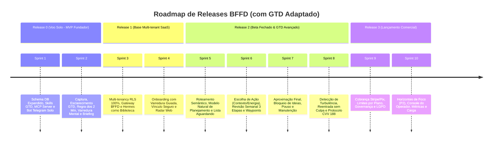

# BFFD — Plano de Sprints e User Stories (Atualizado com GTD)

> **Documento de Engenharia & Produto**  
> **Baseado em:** [BFFD — PRD](file:///f:/Projetos/_FBR/BFFD/BFFD%20%E2%80%94%20PRD.md) e [Torre de Controle — Projeto Conceitual](file:///f:/Projetos/_FBR/BFFD/Torre%20de%20Controle%20%E2%80%94%20Projeto%20Conceitual.md)  
> **Status:** Atualizado com Módulo GTD Integrado (RF50 a RF59) e Esquema de Dados Expandido

---

## 1. Visão Geral do Roadmap e Sprints

O desenvolvimento do BFFD está estruturado em **10 Sprints quinzenais** organizadas em **4 Releases evolutivas**, integrando a gestão de projetos de aviação ao método **Getting Things Done (GTD)** adaptado para TDAH:

---

## 2. Mapa de Épicos do Produto

1. **[EPIC-01] Fundação de Dados, RLS & Multi-tenancy**
2. **[EPIC-02] Runtime de IA, Hermes Agent & Bia Torres (Coach GTD)**
3. **[EPIC-03] Captura Multimodal & Roteamento Semântico de Contexto**
4. **[EPIC-04] Ciclo de Vida do Voo, Planejamento Natural & Controle de Tráfego**
5. **[EPIC-05] Rotinas Proativas, Agendamento & Revisão Semanal GTD**
6. **[EPIC-06] Próximas Ações, Contextos, Energia & Lista Aguardando**
7. **[EPIC-07] Aproximação Final, Checklist de Pouso & Manutenção**
8. **[EPIC-08] Modo Turbulência, Acolhimento & Reentrada sem Culpa**
9. **[EPIC-09] Painel Web, Radar de Voos & Horizontes de Foco**
10. **[EPIC-10] Monetização, Assinaturas, LGPD & Console do Operador**

---

## 3. Detalhamento das Sprints e User Stories

---

### 🚀 RELEASE 0: VOO SOLO (Dogfooding Fundador - 4 Semanas)

#### SPRINT 1: Fundação do Sistema, Schema Expandido e Skills GTD Base
**Objetivo:** Criar o schema Postgres com `pgvector` incluindo os novos campos GTD (`contexto`, `energia`, `aguardando_de`, `aguardando_desde`), servidor MCP e carregar a base de conhecimento GTD como skills da Bia Torres.

---

##### Story 1.1: Modelagem e Schema Postgres com pgvector e Atributos GTD
- **ID:** `US-01`
- **Épico:** `EPIC-01` | **PRD Ref:** Seção 8.1, `RNF01`, `RNF02`
- **Descrição:**  
  *Como* desenvolvedor do sistema,  
  *Quero* criar o banco de dados relacional com suporte vetorial e campos GTD nas tabelas `voos` e `acoes`,  
  *Para que* o sistema armazene o estado dos projetos, contextos de execução e pendências delegadas.
- **Critérios de Aceite:**
  1. Extensão `vector` ativa no Postgres.
  2. Tabela `voos` criada com campos: `id`, `tenant_id`, `pilot_id`, `nome`, `categoria` (profissional/pessoal), `estagio`, `destino`, `motivo`, `prazo`, `prioridade`, `energia`, `embedding`, `ultima_interacao`.
  3. Tabela `acoes` criada com campos GTD: `id`, `tenant_id`, `waypoint_id`, `descricao`, `minutos`, `contexto` (computador, celular, rua, casa), `energia` (alta, média, baixa), `status`, `aguardando_de`, `aguardando_desde`.
  4. Tabelas `tenants`, `pilotos`, `waypoints`, `capturas`, `perguntas`, `eventos`, `memorias`, `rotinas` criadas com isolamento por `tenant_id` e `pilot_id`.
- **DoD:** Migrations executadas sem erros e script de seed com dados de teste validado.

---

##### Story 1.2: Servidor MCP e Ferramentas Nucleares de Negócio
- **ID:** `US-02`
- **Épico:** `EPIC-01` / `EPIC-02` | **PRD Ref:** Seção 7.5, `HM03`, `HM04`
- **Descrição:**  
  *Como* agente inteligente (Bia Torres),  
  *Quero* expor ferramentas MCP padronizadas com validação estrita de esquemas,  
  *Para que* a IA interaja com segurança com as regras de negócio e transições de voo do BFFD.
- **Critérios de Aceite:**
  1. Implementação das ferramentas MCP: `registrar_captura`, `vincular_captura`, `criar_rascunho`, `atualizar_plano_de_voo`, `mudar_estagio`, `gerenciar_waypoints`, `listar_voos`, `proxima_acao`, `registrar_evento`.
  2. `mudar_estagio` valida estritamente a máquina de estados (`Rascunho` -> `PlanoDeVoo` -> `ProntoParaDecolar` -> `EmRota` / `VooCurto` / `Hold` / `AproximacaoFinal` / `Manutencao` / `Encerrado`).
  3. Cada mutação grava automaticamente um registro cronológico na tabela `eventos` (caixa-preta).
- **DoD:** 100% de testes unitários passando em todas as transições de estado do MCP.

---

##### Story 1.3: Integração Hermes Solo e Base de Conhecimento GTD (Skills da Bia)
- **ID:** `US-03`
- **Épico:** `EPIC-02` | **PRD Ref:** `RF59`, `HM01`, `HM03`, `9.4`
- **Descrição:**  
  *Como* piloto fundador,  
  *Quero* conversar com a Bia Torres no Telegram com sua persona despojada e sua base de conhecimento GTD carregada como skills,  
  *Para que* ela atue como minha coach natural de produtividade sem jargões cansativos.
- **Critérios de Aceite:**
  1. Bot Telegram conectado à instância do Hermes.
  2. Persona "Bia Torres" configurada: informal, amiga experiente em aviação, mensagens curtas (até 3 linhas), acolhedora (`9.1`, `9.2`).
  3. Base de conhecimento GTD compilada em skills versionadas no repositório (capturar, esclarecer, organizar, refletir e engajar com adaptação para TDAH) (`RF59`).
  4. Bia orienta o piloto com explicações de no máximo 2 linhas quando ele trava (`9.4`).
- **DoD:** Diálogo fluido no Telegram demonstrando o tom e as diretrizes GTD da Bia.

---

#### SPRINT 2: Captura, Esclarecimento GTD, Regra dos 2 Minutos e Briefing
**Objetivo:** Implementar a captura rápida de texto e voz, a varredura mental, o fluxo de esclarecimento GTD, a regra dos 2 minutos e o envio do briefing diário.

---

##### Story 2.1: Captura e Transcrição Ágil com Confirmação sem Fricção
- **ID:** `US-04`
- **Épico:** `EPIC-03` | **PRD Ref:** `RF01`, `RF02`, `RF06`, `RNF09`, `RNF13`
- **Descrição:**  
  *Como* piloto com TDAH,  
  *Quero* enviar áudios de até 5 minutos ou textos rápidos no Telegram e receber confirmação em menos de 1 linha,  
  *Para que* eu capture ideias em menos de 10 segundos sem atrito.
- **Critérios de Aceite:**
  1. Áudio salvo no Storage seguro antes da transcrição (`RNF13`).
  2. Transcrição Whisper com resposta ao usuário em menos de 10 segundos (`RNF09`).
  3. Confirmação instantânea em 1 linha (ex: *"Anotado e no radar! ✈️"*), sem perguntas bloqueantes (`RF06`).
  4. Nenhuma captura é descartada; se não tiver voo associado, fica na Caixa de Entrada (`RN09`).
- **DoD:** Gravações de áudio pelo celular enviadas ao bot transcritas e confirmadas em até 10s.

---

##### Story 2.2: Fluxo de Esclarecimento GTD e Regra dos 2 Minutos
- **ID:** `US-05`
- **Épico:** `EPIC-04` / `EPIC-06` | **PRD Ref:** `RF51`, `RF52`
- **Descrição:**  
  *Como* piloto,  
  *Quero* que a Bia me ajude a esclarecer itens capturados ("exige ação?") e aplique a regra dos 2 minutos,  
  *Para que* tarefas ultra rápidas sejam resolvidas na hora sem acumular listas.
- **Critérios de Aceite:**
  1. Ao processar uma captura, a Bia avalia se exige ação (`RF51`):
     - **Não:** direciona para Lixo/Descarte, Referência ou Hold/Algum dia.
     - **Sim:** identifica o resultado desejado e a próxima ação física.
  2. Se a próxima ação levar **menos de 2 minutos** (`RF52`), a Bia sugere: *"Essa manobra leva menos de 2 minutinhos. Bora fazer agora?"*
  3. Ao receber confirmação do piloto ("fiz", "pronto"), marca como concluída e registra evento.
- **DoD:** Testes conversacionais validando descarte, referência e execução imediata de 2 minutos.

---

##### Story 2.3: Varredura Mental Guiada Solo e Briefing Matinal
- **ID:** `US-06`
- **Épico:** `EPIC-05` | **PRD Ref:** `RF28`, `RF32`, `RF50`, `RN11`, `RN15`
- **Descrição:**  
  *Como* piloto,  
  *Quero* fazer a varredura mental guiada por áreas da vida e receber o briefing diário matinal às 09:00,  
  *Para que* meu cérebro esvazie as preocupações e eu comece o dia com uma única próxima manobra.
- **Critérios de Aceite:**
  1. Comando/gatilho para Varredura Mental: a Bia percorre áreas da vida (trabalho, finanças, casa, saúde, projetos) até o piloto confirmar que esvaziou a cabeça (`RF50`).
  2. Agendamento do Briefing matinal às 09:00 em dias úteis (`RN11`, `RF28`).
  3. Mensagem do briefing apresenta **1 único voo prioritário** e **1 próxima ação clara** (máximo 3 linhas).
  4. Silêncio absoluto nos fins de semana, a menos que o piloto inicie o contato (`RN15`, `RF32`).
- **DoD:** Briefing entregue no horário com interação e varredura mental inicial concluída.

---

### 🏢 RELEASE 1: BASE MULTI-TENANT (SaaS Foundation - 4 Semanas)

#### SPRINT 3: Arquitetura Multi-tenant, RLS e Hermes como Biblioteca
**Objetivo:** Implementar Row Level Security (RLS) rígido em 100% das tabelas, arquitetura Option C do Hermes AIAgent com isolamento total e observabilidade.

---

##### Story 3.1: Isolamento Rigoroso com Row Level Security (RLS)
- **ID:** `US-07`
- **Épico:** `EPIC-01` | **PRD Ref:** `MT01`, `MT02`, `RNF02`
- **Descrição:**  
  *Como* arquiteto de segurança,  
  *Quero* políticas de RLS ativas em todas as tabelas de domínio baseadas no contexto de sessão do piloto,  
  *Para que* haja isolamento matemático garantido entre diferentes contas e pilotos.
- **Critérios de Aceite:**
  1. `FORCE ROW LEVEL SECURITY` em todas as tabelas de domínio (`MT01`).
  2. Políticas RLS validam `tenant_id` e `pilot_id` em operações de SELECT, INSERT, UPDATE, DELETE.
  3. Suíte de testes automatizados no CI simulando ataques de vazamento de dados entre pilotos (`MT02`, `RNF02`).
- **DoD:** Testes de CI passam com 100% de sucesso contra tentativas de vazamento multi-tenant.

---

##### Story 3.2: Gateway BFFD e Hermes como Biblioteca Python (Opção C)
- **ID:** `US-08`
- **Épico:** `EPIC-02` | **PRD Ref:** Seção 7.2, 7.3, `HM01`, `HM02`, `HM04`, `HM05`
- **Descrição:**  
  *Como* backend do BFFD,  
  *Quero* autenticar o webhook do Telegram, emitir token assinado de sessão e chamar o Hermes `AIAgent` com injeção isolada de contexto,  
  *Para que* o sistema escale horizontalmente sem compartilhar memórias entre usuários.
- **Critérios de Aceite:**
  1. Gateway recebe webhook, identifica o piloto pelo `telegram_user_id` e emite JWT de sessão de curta duração (`HM01`, `HM04`).
  2. Instanciação do `AIAgent` injetando memórias e histórico exclusivos do piloto a partir do Postgres (`HM02`, `HM05`).
  3. O servidor MCP valida a assinatura do token antes de executar qualquer ferramenta de negócio (`MT04`).
- **DoD:** Múltiplos pilotos simultâneos recebem respostas personalizadas e perfeitamente isoladas.

---

##### Story 3.3: Observabilidade, Auditoria e Rastreamento de Custos
- **ID:** `US-09`
- **Épico:** `EPIC-10` | **PRD Ref:** `HM09`, `MT12`, `RNF14`, `RNF15`
- **Descrição:**  
  *Como* operador,  
  *Quero* registrar cada interação com tokens consumidos, custos de LLM e log de eventos administrativos,  
  *Para que* a operação seja transparente e auditável.
- **Critérios de Aceite:**
  1. Log estruturado com `trace_id` ligando Webhook -> Agente -> MCP -> Banco.
  2. Tabela `auditoria` registra alterações de planos, configurações e acessos administrativos (`MT12`).
  3. Métricas de custo de IA calculadas por piloto/tenant com alerta para consumo anormal (`RNF14`).
- **DoD:** Logs e painel de consumo de IA integrados à stack de monitoramento.

---

#### SPRINT 4: Onboarding Seguro, Varredura Guiada e Radar Web
**Objetivo:** Permitir cadastro de novos pilotos com link de uso único no Telegram, varredura mental no onboarding e disponibilizar o Radar de Voos no painel web.

---

##### Story 4.1: Onboarding Web, Vínculo Seguro do Telegram e Varredura Inicial
- **ID:** `US-10`
- **Épico:** `EPIC-01` / `EPIC-09` | **PRD Ref:** Seção 6.3, `MT03`, `RF50`, `J1`
- **Descrição:**  
  *Como* novo piloto,  
  *Quero* me cadastrar na web, vincular meu Telegram por um link de uso único e fazer minha primeira varredura mental em 10 minutos,  
  *Para que* eu comece a usar a torre de controle imediatamente sem complicação.
- **Critérios de Aceite:**
  1. Cadastro web com termos de consentimento LGPD explícitos (`RNF05`).
  2. Deep link Telegram com token criptográfico de uso único válido por 15 minutos (`MT03`).
  3. Ao clicar `/start`, o vínculo é validado e a Bia inicia a jornada com a Varredura Mental Guiada (`J1`, `RF50`).
  4. O piloto finaliza o onboarding com pelo menos 1 voo em preparação.
- **DoD:** Teste de ponta a ponta do cadastro até o primeiro voo registrado no Telegram.

---

##### Story 4.2: Painel Web — Radar de Voos e Detalhes
- **ID:** `US-11`
- **Épico:** `EPIC-09` | **PRD Ref:** `RF44`, `RF45`, `RF05`, `RNF16`
- **Descrição:**  
  *Como* piloto,  
  *Quero* acessar o Radar de Voos na web para ver meus projetos organizados por grupos (Ativos, Curtos, Preparação, Hold, Manutenção),  
  *Para que* eu tenha clareza visual completa do meu espaço aéreo.
- **Critérios de Aceite:**
  1. Interface Next.js moderna, tema claro/escuro e acessibilidade WCAG 2.1 AA (`RNF16`).
  2. Radar de voos agrupado por status conforme a metáfora de tráfego aéreo (`RF44`).
  3. Tela de detalhes do voo: plano de voo, waypoints, próximas ações, capturas anexadas e log da caixa-preta (`RF45`).
  4. Formulário web para cadastro e edição formal de voos (`RF05`).
- **DoD:** Painel web responsivo e integrado ao Supabase com dados protegidos por RLS.

---

##### Story 4.3: Painel Web — Caixa de Entrada, Configurações e Exportação LGPD
- **ID:** `US-12`
- **Épico:** `EPIC-09` / `EPIC-10` | **PRD Ref:** `RF46`, `RF47`, `MT06`, `MT09`, `MT10`
- **Descrição:**  
  *Como* piloto,  
  *Quero* gerenciar capturas soltas na Caixa de Entrada, ajustar meus horários/limites e exportar meus dados,  
  *Para que* eu mantenha o controle total sobre minhas informações e preferências.
- **Critérios de Aceite:**
  1. Caixa de entrada web permitindo vincular capturas a voos ou descartar com 1 clique (`RF46`).
  2. Configuração de horários de rotinas (9h, 14h, 19h), fuso horário e limites de voos ativos (`RF47`, `MT06`).
  3. Botão de exportação completa dos dados em formato JSON e Markdown (`MT09`).
  4. Solicitação de exclusão definitiva de conta com purga total em até 30 dias (`MT10`).
- **DoD:** Funcionalidades de caixa de entrada, configurações e exportação de dados homologadas.

---

### 🧪 RELEASE 2: BETA FECHADO (Recursos P1 & GTD Avançado - 8 Semanas)

#### SPRINT 5: Roteamento Semântico, Modelo Natural e Lista Aguardando
**Objetivo:** Implementar roteamento semântico vetorial, Modelo Natural de Planejamento na definição de voos, suporte a contextos e gestão de ações delegadas (Aguardando).

---

##### Story 5.1: Roteamento Semântico de Capturas e Aprendizado
- **ID:** `US-13`
- **Épico:** `EPIC-03` | **PRD Ref:** `RF07` a `RF13`
- **Descrição:**  
  *Como* piloto,  
  *Quero* que a Bia classifique o tipo da minha captura e a vincule automaticamente ao voo certo usando busca vetorial,  
  *Para que* minhas anotações se organizem sozinhas com precisão.
- **Critérios de Aceite:**
  1. Classificação em: *Ideia, Tarefa, Decisão, Referência, Bloqueio ou Progresso* (`RF07`).
  2. Busca semântica via `pgvector` restrita aos voos do próprio piloto (`RF08`).
  3. **Confiança > 0.85:** vincula automaticamente e avisa em 1 linha (`RF09`).
  4. **Confiança entre 0.55 e 0.85:** envia botões no Telegram com até 3 opções de voos + "É novo" + "Deixa na caixa" (`RF10`).
  5. **Confiança < 0.55:** salva na Caixa de Entrada sem interromper (`RF11`).
  6. Correções do piloto viram exemplos na tabela `memorias` para calibrar classificações futuras (`RF12`).
- **DoD:** Precisão de roteamento superior a 80% comprovada em suite de testes de embeddings.

---

##### Story 5.2: Detecção de Tráfego e Modelo Natural de Planejamento
- **ID:** `US-14`
- **Épico:** `EPIC-04` | **PRD Ref:** `RF14` a `RF17`, `RF57`, `RN10`, `J3`
- **Descrição:**  
  *Como* piloto,  
  *Quero* que a Bia identifique novas intenções de projetos e construa o plano de voo aos poucos seguindo o Modelo Natural de Planejamento GTD,  
  *Para que* o projeto tenha propósito, visão clara e primeira manobra sem me sobrecarregar.
- **Critérios de Aceite:**
  1. Bia detecta tráfego não identificado e propõe criar rascunho (`RF14`, `RF15`).
  2. Condução progressiva com **no máximo 1 pergunta por interação** (`RN10`, `RF16`).
  3. Etapas do Modelo Natural GTD: 1) Propósito/Motivo, 2) Visão do Destino, 3) Brainstorming/Ideias, 4) Organização/Waypoints e 5) Próxima Ação física (`RF57`).
  4. Validação de tangibilidade: recusa destinos vagos e sugere versão verificável (`RF17`).
- **DoD:** Diálogo fluido de criação de novo voo respeitando a cadência de 1 pergunta por vez.

---

##### Story 5.3: Lista Aguardando (Ações Delegadas) e Contextos nas Ações
- **ID:** `US-15`
- **Épico:** `EPIC-06` | **PRD Ref:** `RF53`, `RF54`
- **Descrição:**  
  *Como* piloto,  
  *Quero* delegar ações para terceiros na lista Aguardando e etiquetar ações por contexto (computador, celular, rua, casa),  
  *Para que* eu saiba o que posso fazer no meu ambiente atual e a Bia me lembre de cobrar respostas.
- **Critérios de Aceite:**
  1. Registro de ação com contexto: `@computador`, `@celular`, `@rua`, `@casa` (`RF54`).
  2. Consulta rápida por contexto: "O que dá pra fazer no celular agora?" retorna apenas manobras possíveis.
  3. Ações delegadas guardam `aguardando_de` (nome da pessoa) e `aguardando_desde` (data) (`RF53`).
  4. A Bia monitora pendências aguardando há mais de 5 dias e sugere cobrança no briefing ou revisão semanal.
- **DoD:** Testes de comandos de contexto e alertas automáticos de pendências aguardando.

---

#### SPRINT 6: Escolha de Ação, Revisão Semanal GTD em 3 Etapas e Waypoints
**Objetivo:** Implementar o algoritmo de escolha de próxima ação (contexto/energia/tempo), o fluxo completo de revisão semanal GTD e validação tangível de waypoints.

---

##### Story 6.1: Escolha da Próxima Ação por Contexto, Tempo e Energia
- **ID:** `US-16`
- **Épico:** `EPIC-06` | **PRD Ref:** `RF55`, `RF19`, `RN08`
- **Descrição:**  
  *Como* piloto com energia variável,  
  *Quero* que a Bia considere onde estou, meu tempo livre e meu nível de energia para sugerir a próxima ação ideal,  
  *Para que* eu não tente fazer tarefas pesadas quando estiver cansado e continue avançando.
- **Critérios de Aceite:**
  1. Bia pergunta/avalia: 1) Pista/Contexto atual, 2) Tempo disponível (minutos), 3) Combustível/Energia (baixa, média, alta) (`RF55`).
  2. Algoritmo cruza esses dados com a prioridade dos voos ativos e seleciona a manobra exata mais eficiente (`RF19`).
  3. Ação sugerida começa sempre com verbo físico de execução imediata (ex: *"abrir o Figma"*, *"escrever parágrafo"* — `RF25`).
- **DoD:** Algoritmo de recomendação contextual validado em diferentes cenários de energia e tempo.

---

##### Story 6.2: Revisão Semanal Guiada em Três Etapas (GTD)
- **ID:** `US-17`
- **Épico:** `EPIC-05` | **PRD Ref:** `RF31`, `RF56`, `RN14`
- **Descrição:**  
  *Como* piloto,  
  *Quero* que a Bia conduza minha Revisão Semanal na sexta às 17h estruturada nas etapas: Esvaziar, Atualizar e Criar,  
  *Para que* eu mantenha meu sistema confiável e feche a semana com a mente tranquila.
- **Critérios de Aceite:**
  1. Notificação pontual na sexta às 17h convidando para a revisão de 15 a 30 min (`RN14`).
  2. **Etapa 1 (Esvaziar):** processamento rápido de todas as capturas pendentes na Caixa de Entrada (`RF56`).
  3. **Etapa 2 (Atualizar):** revisão dos voos em rota, checagem da lista Aguardando e próximas ações (`RF56`).
  4. **Etapa 3 (Criar):** olhar voos em hold/algum dia e novas ideias para planejar a próxima semana (`RF56`).
  5. Encerramento celebrando as vitórias da semana na caixa-preta.
- **DoD:** Fluxo de revisão semanal de 3 etapas testado e validado de ponta a ponta no Telegram.

---

##### Story 6.3: Check-in, Debriefing e Reconhecimento de Waypoints
- **ID:** `US-18`
- **Épico:** `EPIC-04` / `EPIC-05` | **PRD Ref:** `RF23` a `RF27`, `RF29`, `RF30`, `RN12`, `RN13`
- **Descrição:**  
  *Como* piloto,  
  *Quero* receber check-in às 14h, debriefing às 19h e comemorar a conclusão de marcos tangíveis (waypoints),  
  *Para que* meu progresso seja visível e eu receba dopamina positiva sem culpa.
- **Critérios de Aceite:**
  1. Check-in às 14:00 com 1 pergunta e botões rápidos (`RF29`, `RN12`).
  2. Debriefing às 19:00 com resumo neutro e livre de julgamentos (`RF30`, `RN13`).
  3. Waypoints formatados para 1 a 2 semanas com teste "dá para ver, mostrar ou usar?" (`RF23`, `RF24`).
  4. Conclusão de waypoint gera comemoração efusiva da Bia e evento de caixa-preta (`RF27`).
- **DoD:** Ciclo diário de mensagens e registro de progresso operando com alto índice de resposta.

---

#### SPRINT 7: Aproximação Final, Bloqueio de Escopo, Pouso e Manutenção
**Objetivo:** Implementar ativação automática da Aproximação Final, desvio de ideias novas para backlog pós-pouso, checklist de pouso e ciclo de manutenção.

---

##### Story 7.1: Ativação de Aproximação Final e Desvio de Escopo
- **ID:** `US-19`
- **Épico:** `EPIC-07` | **PRD Ref:** `RF34`, `RF35`, `RN06`, `J5`
- **Descrição:**  
  *Como* piloto que está nos últimos 20% do projeto,  
  *Quero* que a Bia ative a Aproximação Final e desvie novas ideias para o backlog de pós-pouso,  
  *Para que* eu não sofra com *scope creep* e consiga finalizar o projeto.
- **Critérios de Aceite:**
  1. Transição para `AproximacaoFinal` automática ao atingir 80% dos waypoints ou 7 dias antes do prazo (`RN06`, `RF34`).
  2. Mensagem da Bia avisando a entrada no cone de aproximação.
  3. Novas capturas com ideias para este projeto são salvas automaticamente na pasta "Pós-Pouso / Manutenção", protegendo a pista (`RF35`).
- **DoD:** Testes comprovando o bloqueio e desvio de novas ideias durante a aproximação final.

---

##### Story 7.2: Checklist de Pouso, Pouso Parcial e Comemoração
- **ID:** `US-20`
- **Épico:** `EPIC-07` | **PRD Ref:** `RF36`, `RF37`
- **Descrição:**  
  *Como* piloto,  
  *Quero* um checklist objetivo contendo apenas as manobras finais para pousar e a opção de declarar pouso parcial,  
  *Para que* eu termine o projeto sem perfeccionismo paralisante.
- **Critérios de Aceite:**
  1. Checklist enxuto de pouso enviado e marcável no Telegram (`RF36`).
  2. Suporte ao comando "Declarar pouso parcial": registra a versão simplificada entregue como pouso bem-sucedido (`RF37`).
  3. Celebração efusiva da Bia e atualização do status para `Manutencao`.
- **DoD:** Fluxo de checklist e comando de pouso parcial validados com geração de evento de conclusão.

---

##### Story 7.3: Fase de Manutenção, Geração de Novos Voos e Histórico
- **ID:** `US-21`
- **Épico:** `EPIC-07` / `EPIC-09` | **PRD Ref:** `RF38`, `RF48`, `RN07`, Seção 6
- **Descrição:**  
  *Como* piloto com projeto pousado,  
  *Quero* conduzir a manutenção (revisão da entrega, reposição e seleção de novas ideias para novos voos),  
  *Para que* os aprendizados sejam colhidos e a vaga no espaço aéreo seja liberada.
- **Critérios de Aceite:**
  1. Bia conduz a manutenção: o que repor, revisão da entrega e triagem das ideias do backlog pós-pouso (`RF38`).
  2. Ideias selecionadas podem transicionar diretamente para `ProntoParaDecolar` como novo voo gerado (conforme máquina de estados do Projeto Conceitual).
  3. Quando não há mais nada a repor, voo transiciona para `Encerrado`.
  4. Tela "Histórico de Pousos" no painel web atualizada com troféu e métricas do projeto (`RF48`).
- **DoD:** Voo arquivado com aprendizados e vaga na categoria liberada para novos projetos.

---

#### SPRINT 8: Detecção de Turbulência, Reentrada sem Culpa e Protocolo CVV 188
**Objetivo:** Implementar o cálculo diário de turbulência (afastamento e sobrecarga), fluxo de reentrada acolhedor e interceptação de risco grave com canal de ajuda (CVV 188).

---

##### Story 8.1: Cálculo Diário de Sinais de Turbulência e Ajuste do Agente
- **ID:** `US-22`
- **Épico:** `EPIC-08` | **PRD Ref:** `RF39`, `RF40`, `RF41`, `RN16` a `RN21`
- **Descrição:**  
  *Como* sistema de apoio empático,  
  *Quero* avaliar diariamente sinais de afastamento e sobrecarga para dosar o tom e o volume de mensagens da Bia,  
  *Para que* o piloto receba apoio proporcional sem se sentir pressionado.
- **Critérios de Aceite:**
  1. Job diário calcula sinais de afastamento (`RN16`: 1-3 dias = Leve, 4-7 = Moderada, 8+ = Forte) e sobrecarga (`RN18`, `RN19`, `RN20`).
  2. Análise de sentimento para detectar linguagem de desânimo (`RF40`, `RN21`).
  3. **Comportamento ajustado:**
     - *Leve:* mensagem sutil com passo de até 2 minutos.
     - *Moderada:* suspende check-ins e debriefings; mantém apenas briefing de reconexão.
     - *Forte:* pergunta como o piloto está sem falar de tarefas; sugere apoio de confiança.
     - *Sobrecarga:* propõe triagem rápida de 10 min (manter, pausar ou arquivar).
- **DoD:** Matriz de testes cobrindo todas as transições e respostas da Bia em modo turbulência.

---

##### Story 8.2: Fluxo de Reentrada Acolhedor sem Culpa
- **ID:** `US-23`
- **Épico:** `EPIC-08` | **PRD Ref:** `RF42`, `J6`, `Princípio 5`
- **Descrição:**  
  *Como* piloto que se ausentou por vários dias,  
  *Quero* que a Bia me receba com carinho e um resumo limpo de onde cada voo parou, sem exibir listas de atraso,  
  *Para que* eu volte a pilotar sem sentir vergonha ou frustração.
- **Critérios de Aceite:**
  1. Ao piloto enviar mensagem após ausência prolongada, a Bia acolhe calorosamente.
  2. Apresenta o "Resumo de Reentrada": posição atual dos voos e 1 micro manobra física para recomeçar (`RF42`).
  3. Nenhuma notificação contém palavras punitivas ou contadores de atraso.
  4. Reset suave do estado de turbulência após o primeiro passo concluído.
- **DoD:** Teste com usuário em simulação de retorno após 7 dias de ausência.

---

##### Story 8.3: Protocolo Crítico de Segurança e Interceptação de Crise (CVV 188)
- **ID:** `US-24`
- **Épico:** `EPIC-08` | **PRD Ref:** `RF43`, `9.3`, `RNF05`
- **Descrição:**  
  *Como* plataforma responsável,  
  *Quero* interceptar menções a autolesão ou crise severa, interromper o personagem e fornecer imediatamente os canais de apoio (CVV 188),  
  *Para que* o usuário receba direcionamento profissional e humano adequado em momentos críticos.
- **Critérios de Aceite:**
  1. Interceptador de segurança em tempo real para expressões de autolesão ou ideação de risco (`RF43`).
  2. Interrupção imediata da persona Bia Torres.
  3. Mensagem séria, respeitosa e clara fornecendo contatos de emergência (**CVV - Centro de Valorização da Vida: Ligue 188** no Brasil).
  4. Registro seguro de auditoria do acionamento mantendo sigilo de dados sensíveis.
- **DoD:** Testes automatizados de segurança com disparador infalível do protocolo de crise.

---

### 🚀 RELEASE 3: LANÇAMENTO & OPERAÇÃO (SaaS Comercial - 4 Semanas)

#### SPRINT 9: Cobrança, Planos, Limites de Uso e Compliance LGPD
**Objetivo:** Integrar gateway de pagamentos recorrentes (Stripe/Pix), impor limites por plano (Solo, Família, Profissional) e assegurar conformidade total com a LGPD.

---

##### Story 9.1: Cobrança Recorrente e Limites de Uso por Plano
- **ID:** `US-25`
- **Épico:** `EPIC-10` | **PRD Ref:** `MT07`, `MT08`, Seção 6.4
- **Descrição:**  
  *Como* administrador da conta,  
  *Quero* assinar um plano (Solo, Família, Profissional) via Cartão de Crédito ou Pix no painel web,  
  *Para que* minha conta tenha acesso liberado com limites adequados de pilotos e minutos de áudio.
- **Critérios de Aceite:**
  1. Integração com gateway de pagamentos com suporte a Cartão de Crédito e Pix (`MT08`).
  2. Webhook de renovação automática e conciliação de faturas.
  3. Controle e aviso amigável ao aproximar de limites do plano (pilotos ou minutos de áudio) (`MT07`).
  4. Painel de gestão de assinatura e troca de plano.
- **DoD:** Checkout, conciliação e upgrade de planos homologados em ambiente de testes.

---

##### Story 9.2: Conformidade Completa LGPD, Expurgo e Termos
- **ID:** `US-26`
- **Épico:** `EPIC-01` / `EPIC-10` | **PRD Ref:** `RNF05` a `RNF07`, `MT09`, `MT10`
- **Descrição:**  
  *Como* encarregado de dados (DPO),  
  *Quero* garantir exportação completa dos dados do titular e expurgo automatizado de dados e áudios em até 30 dias,  
  *Para que* a plataforma esteja 100% aderente à LGPD.
- **Critérios de Aceite:**
  1. Exportação completa do piloto em `.zip` com JSON e Markdown estruturados (`MT09`, `RNF06`).
  2. Job de expurgo que deleta definitivamente registros, memórias vetoriais e áudios do Storage em até 30 dias após pedido de exclusão (`MT10`).
  3. Lista pública de subprocessadores de IA sem autorização para treino com dados dos usuários (`RNF07`).
- **DoD:** Relatório de auditoria de privacidade e compliance LGPD aprovado.

---

#### SPRINT 10: Horizontes de Foco, Console do Operador e Testes de Carga
**Objetivo:** Implementar os Horizontes de Foco GTD (P2), Console do Operador BFFD, painel de indicadores e testes de carga para 1.000 pilotos.

---

##### Story 10.1: Horizontes de Foco GTD no Painel Web (P2)
- **ID:** `US-27`
- **Épico:** `EPIC-09` | **PRD Ref:** `RF58`, `Módulo 6 GTD`
- **Descrição:**  
  *Como* piloto,  
  *Quero* cadastrar minhas Áreas de Responsabilidade, Metas e Visão (Altitudes do GTD) e conectá-las aos meus voos ativos,  
  *Para que* eu entenda o propósito maior de cada projeto e mantenha a motivação em longo prazo.
- **Critérios de Aceite:**
  1. Tela "Altitudes de Voo" no painel web com os níveis: Pista (Ações), Projetos (Voos), Áreas de Responsabilidade, Metas (1-2 anos) e Visão/Propósito (`RF58`).
  2. Associação de cada voo a pelo menos uma área ou meta.
  3. Revisão mensal sugerida pela Bia para avaliar o alinhamento com as altitudes superiores.
- **DoD:** Módulo de Horizontes de Foco funcional e integrado ao Radar de Voos.

---

##### Story 10.2: Console do Operador da Plataforma (Sem Acesso a Conteúdo)
- **ID:** `US-28`
- **Épico:** `EPIC-10` | **PRD Ref:** `MT11`, `42`
- **Descrição:**  
  *Como* operador do BFFD,  
  *Quero* visualizar métricas agregadas de saúde dos serviços, tenants ativos e custos de LLM sem ter acesso ao conteúdo dos projetos,  
  *Para que* eu gerencie a infraestrutura mantendo a privacidade total dos usuários.
- **Critérios de Aceite:**
  1. Painel exclusivo para o papel `operador` (`MT11`).
  2. Métricas de tenants ativos, churn, faturamento e falhas de entrega de rotinas.
  3. Políticas RLS impedem categoricamente a leitura de títulos de voos, capturas ou transcrições dos pilotos.
- **DoD:** Console de operação homologado com restrição absoluta de leitura de conteúdo.

---

##### Story 10.3: Dashboard de Indicadores Pessoais, Testes de Carga e Pentest
- **ID:** `US-29`
- **Épico:** `EPIC-09` / `EPIC-10` | **PRD Ref:** `RF49`, `RNF08`, `RNF09`, `RNF12`, Seção 11
- **Descrição:**  
  *Como* equipe BFFD,  
  *Quero* disponibilizar os indicadores de pousos no painel e validar a performance da infraestrutura sob carga de 1.000 pilotos simultâneos,  
  *Para que* o lançamento público aconteça com excelência operacional.
- **Critérios de Aceite:**
  1. Dashboard do piloto exibindo a **Métrica Norte (Pousos no Trimestre)** e consistência de waypoints (`RF49`, Seção 11).
  2. Testes de carga simulando 1.000 pilotos com p95 de resposta do bot < 3 s em texto e < 10 s em áudio (`RNF08`, `RNF09`, `RNF12`).
  3. Relatório de pentest e correção de eventuais vulnerabilidades antes da abertura das vendas.
- **DoD:** Aplicação aprovada em testes de estresse e dashboard de métricas em produção.

---

## 4. Matriz Completa de Rastreabilidade (PRD ↔ User Stories)

| Requisito PRD | Sprint | ID Story | Título Resumido |
| :--- | :---: | :---: | :--- |
| **RF01, RF02, RF06** | Sprint 2 | `US-04` | Captura e Transcrição Ágil sem Fricção |
| **RF03** | Sprint 5 | `US-13` | Captura Multimodal com Imagens e Visão |
| **RF05, RF44, RF45** | Sprint 4 | `US-11` | Painel Web — Radar de Voos e Detalhes |
| **RF07 a RF13** | Sprint 5 | `US-13` | Roteamento Semântico e Aprendizado |
| **RF14 a RF17, RF57** | Sprint 5 | `US-14` | Detecção de Tráfego e Modelo Natural GTD |
| **RF15, RF18, RF20** | Sprint 2 | `US-05` | Criação de Voos, Limites e Voos Curtos |
| **RF23 a RF27** | Sprint 6 | `US-18` | Waypoints Tangíveis e Celebração |
| **RF28, RF32** | Sprint 2 | `US-06` | Agendamento do Briefing Diário Matinal |
| **RF29, RF30** | Sprint 6 | `US-18` | Check-in da Tarde e Debriefing Noturno |
| **RF31, RF56** | Sprint 6 | `US-17` | Revisão Semanal Guiada em Três Etapas GTD |
| **RF34, RF35** | Sprint 7 | `US-19` | Aproximação Final e Desvio de Ideias |
| **RF36, RF37** | Sprint 7 | `US-20` | Checklist de Pouso e Pouso Parcial |
| **RF38, RF48** | Sprint 7 | `US-21` | Manutenção, Novos Voos e Histórico |
| **RF39 a RF41** | Sprint 8 | `US-22` | Cálculo de Turbulência e Ajuste da Bia |
| **RF42** | Sprint 8 | `US-23` | Fluxo de Reentrada Acolhedor sem Culpa |
| **RF43** | Sprint 8 | `US-24` | Protocolo Crítico de Interceptação (CVV 188) |
| **RF46, RF47** | Sprint 4 | `US-12` | Caixa de Entrada Web e Configurações |
| **RF49** | Sprint 10 | `US-29` | Dashboard de Indicadores Pessoais |
| **RF50** | Sprint 2 / 4 | `US-06` / `US-10` | Varredura Mental Guiada no Onboarding |
| **RF51, RF52** | Sprint 2 | `US-05` | Esclarecimento GTD e Regra dos 2 Minutos |
| **RF53, RF54** | Sprint 5 | `US-15` | Lista Aguardando e Contextos nas Ações |
| **RF55** | Sprint 6 | `US-16` | Escolha de Ação (Contexto, Tempo, Energia) |
| **RF58** | Sprint 10 | `US-27` | Horizontes de Foco GTD no Painel Web |
| **RF59** | Sprint 1 | `US-03` | Base de Conhecimento GTD como Skills da Bia |
| **MT01, MT02** | Sprint 3 | `US-07` | Row Level Security (RLS) em 100% das Tabelas |
| **MT03** | Sprint 4 | `US-10` | Onboarding com Link de Uso Único Telegram |
| **MT04, MT05** | Sprint 3 | `US-08` | Gateway BFFD e Hermes como Biblioteca |
| **MT06** | Sprint 4 | `US-12` | Configurações por Conta e Piloto |
| **MT07, MT08** | Sprint 9 | `US-25` | Cobrança Recorrente e Limites por Plano |
| **MT09, MT10** | Sprint 4 / 9 | `US-12` / `US-26` | Exportação e Exclusão Definitiva (LGPD) |
| **MT11** | Sprint 10 | `US-28` | Console do Operador da Plataforma |
| **MT12, HM09** | Sprint 3 | `US-09` | Observabilidade e Logs de Auditoria |
| **HM01 a HM05** | Sprint 3 | `US-08` | Integração Hermes AIAgent (Opção C) |
| **RN01 a RN10** | Sprint 1 / 2 | `US-01` / `US-05` | Regras de Negócio e Espaço Aéreo |
| **RN11 a RN15** | Sprint 2 / 6 | `US-06` / `US-18` | Rotinas e Fim de Semana Silencioso |
| **RN16 a RN21** | Sprint 8 | `US-22` | Sinais e Limiares de Turbulência |

---

## 5. Próximos Passos de Execução

1. **Sprint 1 (Release 0):** Configurar o repositório, aplicar as migrations do schema Postgres expandido com atributos GTD e instanciar o bot de desenvolvimento no Telegram com as skills da Bia.
2. **Spike de Validação Hermes (Opção C):** Validar a chamada da biblioteca Python `AIAgent` com injeção de memórias dinâmicas por piloto antes do início da Sprint 3.
