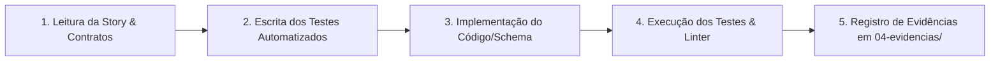

# BFFD — Plano de Implementação Autônoma (Playbook de Execução das Stories)

> **Documento de Engenharia & Execução Autônoma**  
> **Baseado em:** [BFFD — PRD](file:///f:/Projetos/_FBR/BFFD/BFFD%20%E2%80%94%20PRD.md), [BFFD_Sprints_e_Stories.md](file:///f:/Projetos/_FBR/BFFD/BFFD_Sprints_e_Stories.md) e [Torre de Controle — Projeto Conceitual](file:///f:/Projetos/_FBR/BFFD/Torre%20de%20Controle%20%E2%80%94%20Projeto%20Conceitual.md)  
> **Ambiente de Trabalho:** `f:\Projetos\_FBR\BFFD`

---

## 1. Framework de Execução Autônoma

Para que cada Story seja implementada, testada e validada de forma 100% autônoma por agentes ou desenvolvedores, estabelecemos o **Protocolo de 5 Etapas por Story (TDD-GATED)**:



### 1.1 Árvore de Código-Fonte (`09-codigo/`)

```text
09-codigo/
├── db/
│   ├── migrations/          # Arquivos SQL ordenados (001_init.sql, 002_rls.sql, etc.)
│   ├── seeds/               # Dados de teste e pilotos de exemplo
│   └── tests/               # Testes de isolamento RLS e queries vetoriais
├── mcp-server/              # Servidor MCP de regras de negócio (Node.js/TypeScript ou Python)
│   ├── src/
│   │   ├── tools/           # Implementação de cada ferramenta MCP
│   │   ├── domain/          # Máquina de estados dos voos, validações GTD
│   │   ├── security/        # Validador de token assinado por piloto
│   │   └── index.ts
│   └── tests/               # Testes unitários das ferramentas e transições
├── gateway-bot/             # Gateway Telegram Webhook + Autenticação de Piloto
│   ├── src/
│   │   ├── webhook.ts       # Endpoint de recepção do Telegram
│   │   ├── auth.ts          # Resolução de telegram_user_id -> piloto e token JWT
│   │   ├── queue.ts         # Fila de mensagens por piloto
│   │   └── media.ts         # Download e storage seguro de áudios/imagens
├── agent-runtime/           # Worker de IA (Hermes AIAgent como biblioteca)
│   ├── src/
│   │   ├── agent.py         # Instanciação do AIAgent com injeção de contexto
│   │   ├── memory.py        # Recuperação e gravação de memórias no Postgres
│   │   ├── persona.py       # Prompt e diretrizes da Bia Torres (Coach GTD)
│   │   └── skills/          # Skills GTD compiladas (varredura, revisão, etc.)
│   └── tests/               # Testes de prompts e regressão de diálogos
├── scheduler/               # Agendador de rotinas temporais e jobs diários
│   ├── src/
│   │   ├── jobs/            # Briefing, Check-in, Debriefing, Revisão, Turbulência
│   │   └── cron.ts
├── web/                     # Painel Web do Piloto e Console do Operador (Next.js)
│   ├── src/
│   │   ├── app/             # Rotas: /radar, /voos/[id], /inbox, /altitudes, /admin
│   │   ├── components/      # UI components (Radar, Cards, Checklists, Player de Áudio)
│   │   └── lib/             # Supabase Client com RLS, Helpers de Formatação
└── tests/                   # Suíte de Testes de Integração End-to-End
```

---

## 2. Roteiro Passo a Passo de Implementação Autônoma (Stories US-01 a US-29)

---

### 🚀 RELEASE 0: VOO SOLO (Sprint 1 e 2)

---

#### 📍 Story 1.1 (`US-01`): Modelagem e Schema Postgres com pgvector e Campos GTD
- **Objetivo:** Criar o banco relacional completo no Supabase/Postgres com suporte a vetores e atributos do método GTD.
- **Arquivos a Criar:**
  - `09-codigo/db/migrations/001_initial_schema.sql`
  - `09-codigo/db/seeds/001_solo_founder_seed.sql`
  - `09-codigo/db/tests/test_schema_integrity.sql`
- **Passos Autônomos:**
  1. Escrever migration com extensão `vector`.
  2. Criar tabelas `tenants`, `pilotos`, `membros`, `voos`, `waypoints`, `acoes`, `capturas`, `perguntas`, `eventos`, `memorias`, `rotinas`, `assinaturas`, `auditoria`.
  3. Adicionar na tabela `acoes`: `contexto`, `energia`, `minutos`, `aguardando_de`, `aguardando_desde`.
  4. Adicionar na tabela `voos`: `embedding vector(1536)`, `categoria`, `estagio`, `destino`, `motivo`, `prazo`.
  5. Criar índices relacionais e índices vetoriais HNSW.
- **Comando de Teste:**
  ```powershell
  npx supabase db reset && npx supabase test db 09-codigo/db/tests/test_schema_integrity.sql
  ```
- **Evidência:** Gerar `04-evidencias/US-01-schema-migration.log`.

---

#### 📍 Story 1.2 (`US-02`): Servidor MCP com Ferramentas Nucleares e Máquina de Estados
- **Objetivo:** Criar o servidor Model Context Protocol com as regras de negócio de voo e transições de estado.
- **Arquivos a Criar:**
  - `09-codigo/mcp-server/package.json`
  - `09-codigo/mcp-server/src/domain/flight-state-machine.ts`
  - `09-codigo/mcp-server/src/tools/flight-tools.ts`
  - `09-codigo/mcp-server/src/tools/capture-tools.ts`
  - `09-codigo/mcp-server/src/index.ts`
  - `09-codigo/mcp-server/tests/flight-state-machine.test.ts`
- **Passos Autônomos:**
  1. Implementar `flight-state-machine.ts` com o grafo do PRD: `Rascunho -> PlanoDeVoo -> ProntoParaDecolar -> EmRota`, `VooCurto -> Manutencao / EmRota`, `Hold -> EmRota`, `EmRota -> AproximacaoFinal -> Manutencao -> Encerrado`.
  2. Implementar ferramentas MCP: `registrar_captura`, `vincular_captura`, `criar_rascunho`, `atualizar_plano_de_voo`, `mudar_estagio`, `gerenciar_waypoints`, `listar_voos`, `proxima_acao`, `registrar_evento`.
  3. Integrar gravação automática na tabela `eventos` (caixa-preta) em cada transição.
- **Comando de Teste:**
  ```powershell
  cd 09-codigo/mcp-server && npm test
  ```
- **Evidência:** Gerar `04-evidencias/US-02-mcp-server-unit-tests.log`.

---

#### 📍 Story 1.3 (`US-03`): Integração Hermes Solo e Base de Conhecimento GTD
- **Objetivo:** Configurar a persona Bia Torres no Hermes Agent com as skills de GTD adaptado para TDAH.
- **Arquivos a Criar:**
  - `09-codigo/agent-runtime/src/persona.py`
  - `09-codigo/agent-runtime/src/skills/gtd_coach.md`
  - `09-codigo/agent-runtime/src/skills/aviation_metaphor.md`
  - `09-codigo/agent-runtime/tests/test_persona_response.py`
- **Passos Autônomos:**
  1. Escrever o System Prompt com as diretrizes de voz da Bia: informal, amiga experiente em aviação, mensagens de até 3 linhas, 1 pergunta por vez, sem jargões desnecessários (`Seção 9.1`).
  2. Implementar as skills GTD: capturar sem esforço, esclarecer se exige ação, regra dos 2 minutos, modelo natural de planejamento (`RF59`, `9.4`).
  3. Conectar o Hermes ao bot do Telegram com ferramentas locais do MCP do BFFD.
- **Comando de Teste:**
  ```powershell
  pytest 09-codigo/agent-runtime/tests/test_persona_response.py
  ```
- **Evidência:** Gerar `04-evidencias/US-03-hermes-solo-dialog.log`.

---

#### 📍 Story 2.1 (`US-04`): Captura e Transcrição Ágil de Áudio/Texto
- **Objetivo:** Processar mensagens de texto e áudios de até 5 minutos via Telegram, salvando o arquivo e transcrevendo via Whisper em até 10s.
- **Arquivos a Criar:**
  - `09-codigo/gateway-bot/src/media-transcriber.ts`
  - `09-codigo/gateway-bot/src/handlers/message-handler.ts`
  - `09-codigo/gateway-bot/tests/audio-pipeline.test.ts`
- **Passos Autônomos:**
  1. Implementar download do áudio `.ogg`/`.oga` do Telegram para o Supabase Storage (`RNF13`).
  2. Invocar Whisper API para transcrição em português-br.
  3. Criar registro na tabela `capturas` e devolver confirmação em 1 linha no Telegram em menos de 10s (`RF01`, `RF02`, `RF06`, `RNF09`).
- **Comando de Teste:**
  ```powershell
  cd 09-codigo/gateway-bot && npm test -- tests/audio-pipeline.test.ts
  ```
- **Evidência:** Gerar `04-evidencias/US-04-audio-transcription-benchmark.log`.

---

#### 📍 Story 2.2 (`US-05`): Fluxo de Esclarecimento GTD, Regra dos 2 Minutos e Limites de Espaço Aéreo
- **Objetivo:** Implementar triagem rápida ("exige ação?"), execução imediata de 2 minutos e controle de limites de voos ativos (2 profissionais, 1 pessoal).
- **Arquivos a Criar:**
  - `09-codigo/mcp-server/src/domain/gtd-clarify.ts`
  - `09-codigo/mcp-server/src/domain/airspace-limiter.ts`
  - `09-codigo/mcp-server/tests/gtd-clarify.test.ts`
- **Passos Autônomos:**
  1. Implementar fluxo `gtd-clarify`: sem ação -> Lixo/Referência/Hold; com ação -> Destino + Próxima ação física (`RF51`).
  2. Se tempo estimado for `< 2 min` (`RF52`), Bia sugere execução imediata e registra conclusão ao receber ok.
  3. Implementar regras de limites `RN01` a `RN08`: bloquear promoção de voo se slots estiverem ocupados e sugerir envio de outro voo para `Hold`.
  4. Implementar voos curtos (`RN03` a `RN05`).
- **Comando de Teste:**
  ```powershell
  cd 09-codigo/mcp-server && npm test -- tests/gtd-clarify.test.ts
  ```
- **Evidência:** Gerar `04-evidencias/US-05-gtd-clarify-and-limits.log`.

---

#### 📍 Story 2.3 (`US-06`): Varredura Mental Guiada e Agendamento do Briefing Matinal
- **Objetivo:** Conduzir a varredura mental no Telegram e agendar o briefing matinal às 09:00 em dias úteis.
- **Arquivos a Criar:**
  - `09-codigo/agent-runtime/src/skills/mind_sweep.py`
  - `09-codigo/scheduler/src/jobs/daily-briefing.ts`
  - `09-codigo/scheduler/tests/briefing-cron.test.ts`
- **Passos Autônomos:**
  1. Implementar skill de Varredura Mental que percorre gatilhos da vida (trabalho, casa, finanças, projetos) até o usuário esvaziar (`RF50`).
  2. Configurar job do Briefing matinal às 09:00 no fuso do piloto (`RN11`, `RF28`).
  3. Formatar mensagem: 1 voo em rota + 1 próxima ação física (máximo 3 linhas) com botão de confirmação.
  4. Garantir silêncio em sábados e domingos (`RN15`, `RF32`).
- **Comando de Teste:**
  ```powershell
  cd 09-codigo/scheduler && npm test -- tests/briefing-cron.test.ts
  ```
- **Evidência:** Gerar `04-evidencias/US-06-briefing-scheduler.log`.

---

### 🏢 RELEASE 1: BASE MULTI-TENANT (Sprint 3 e 4)

---

#### 📍 Story 3.1 (`US-07`): Row Level Security (RLS) em 100% das Tabelas e Testes de Vazamento
- **Objetivo:** Bloquear qualquer vazamento entre tenants com políticas de RLS e validações no CI.
- **Arquivos a Criar:**
  - `09-codigo/db/migrations/002_rls_policies.sql`
  - `09-codigo/db/tests/rls_leak_matrix_test.sql`
- **Passos Autônomos:**
  1. Aplicar `ALTER TABLE ... ENABLE ROW LEVEL SECURITY` em todas as tabelas.
  2. Criar policies baseadas no token de sessão `current_setting('app.current_pilot_id')` e `tenant_id`.
  3. Escrever script de teste tentando cross-tenant injection (Pilot A tentando dar SELECT/UPDATE no voo do Pilot B).
- **Comando de Teste:**
  ```powershell
  npx supabase test db 09-codigo/db/tests/rls_leak_matrix_test.sql
  ```
- **Evidência:** Gerar `04-evidencias/US-07-rls-security-audit.log`.

---

#### 📍 Story 3.2 (`US-08`): Gateway BFFD e Execução do Hermes como Biblioteca Python (Opção C)
- **Objetivo:** Receber mensagens pelo webhook central, emitir token JWT de sessão por piloto e chamar `AIAgent` com memória externalizada.
- **Arquivos a Criar:**
  - `09-codigo/gateway-bot/src/session-token.ts`
  - `09-codigo/agent-runtime/src/hermes_library_runner.py`
  - `09-codigo/agent-runtime/tests/test_multi_pilot_isolation.py`
- **Passos Autônomos:**
  1. Gateway mapeia `telegram_user_id` para `pilot_id` e emite JWT assinado com TTL curto (`HM04`).
  2. `hermes_library_runner.py` carrega histórico e embeddings daquele piloto exclusivo (`HM02`, `HM05`).
  3. Chama a classe `AIAgent` conectando ao MCP Server repassando o token assinado.
  4. MCP Server valida a assinatura criptográfica antes de atender as ferramentas.
- **Comando de Teste:**
  ```powershell
  pytest 09-codigo/agent-runtime/tests/test_multi_pilot_isolation.py
  ```
- **Evidência:** Gerar `04-evidencias/US-08-hermes-library-option-c.log`.

---

#### 📍 Story 3.3 (`US-09`): Observabilidade, Auditoria e Controle de Custos de IA
- **Objetivo:** Registrar logs estruturados com contagem de tokens, chamadas MCP, custos estimados e trilha de auditoria administrativa.
- **Arquivos a Criar:**
  - `09-codigo/gateway-bot/src/telemetry.ts`
  - `09-codigo/db/migrations/003_telemetry_and_audit.sql`
  - `09-codigo/gateway-bot/tests/telemetry.test.ts`
- **Passos Autônomos:**
  1. Middleware grava em `auditoria` qualquer alteração de configuração/plano (`MT12`).
  2. Registra métricas de tokens e latência com correlação por `trace_id` (`HM09`, `RNF14`, `RNF15`).
- **Comando de Teste:**
  ```powershell
  cd 09-codigo/gateway-bot && npm test -- tests/telemetry.test.ts
  ```
- **Evidência:** Gerar `04-evidencias/US-09-observability-telemetry.log`.

---

#### 📍 Story 4.1 (`US-10`): Onboarding Web e Pareamento de Uso Único no Telegram
- **Objetivo:** Criar conta no painel web, aceitar consentimento LGPD e parear o Telegram via token temporário em menos de 15 minutos.
- **Arquivos a Criar:**
  - `09-codigo/web/src/app/auth/signup/page.tsx`
  - `09-codigo/web/src/app/onboarding/link-telegram/page.tsx`
  - `09-codigo/gateway-bot/src/handlers/start-handler.ts`
  - `09-codigo/tests/e2e/onboarding.spec.ts`
- **Passos Autônomos:**
  1. Tela web de cadastro com termos de consentimento explícito LGPD (`RNF05`).
  2. Geração de link `https://t.me/BiaTorresBot?start=TOKEN_UNICO` com validade de 15 min (`MT03`).
  3. Handler `/start` no bot consome o token, vincula `telegram_user_id` e inicia a conversa com a Varredura Mental (`J1`, `RF50`).
- **Comando de Teste:**
  ```powershell
  cd 09-codigo/web && npx playwright test tests/e2e/onboarding.spec.ts
  ```
- **Evidência:** Gerar `04-evidencias/US-10-onboarding-e2e.log`.

---

#### 📍 Story 4.2 (`US-11`): Painel Web — Radar de Voos e Detalhes do Voo
- **Objetivo:** Renderizar a interface de gerenciamento visual de voos por grupos (Ativos, Curtos, Preparação, Hold, Manutenção).
- **Arquivos a Criar:**
  - `09-codigo/web/src/app/radar/page.tsx`
  - `09-codigo/web/src/app/voos/[id]/page.tsx`
  - `09-codigo/web/src/components/RadarBoard.tsx`
  - `09-codigo/web/src/components/FlightDetails.tsx`
  - `09-codigo/web/src/components/NewFlightModal.tsx`
- **Passos Autônomos:**
  1. Construir o componente `RadarBoard` agrupando os voos por status (`RF44`).
  2. Construir `FlightDetails` com: Plano de Voo, Waypoints, Ações, Capturas anexadas e Linha do Tempo da Caixa-Preta (`RF45`).
  3. Formulário de cadastro formal de voos (`RF05`).
  4. Aplicar design moderno, glassmorphism sutil, suporte a Dark Mode e acessibilidade WCAG 2.1 AA (`RNF16`).
- **Comando de Teste:**
  ```powershell
  cd 09-codigo/web && npm run build && npm test
  ```
- **Evidência:** Gerar `04-evidencias/US-11-web-radar-ui.log`.

---

#### 📍 Story 4.3 (`US-12`): Painel Web — Caixa de Entrada, Configurações e Exportação LGPD
- **Objetivo:** Criar tela de Caixa de Entrada para capturas soltas, tela de configurações do piloto e botão de exportação/exclusão de dados.
- **Arquivos a Criar:**
  - `09-codigo/web/src/app/inbox/page.tsx`
  - `09-codigo/web/src/app/configuracoes/page.tsx`
  - `09-codigo/web/src/app/api/export/route.ts`
- **Passos Autônomos:**
  1. Tela `inbox`: lista de capturas sem voo com botão para vincular com 1 clique ou descartar (`RF46`).
  2. Tela `configuracoes`: horários de rotinas, fuso e limites (`RF47`, `MT06`).
  3. Endpoint `/api/export`: gera `.zip` com JSON dos dados e Markdown dos voos (`MT09`).
  4. Endpoint de solicitação de expurgo de conta com prazo de 30 dias (`MT10`).
- **Comando de Teste:**
  ```powershell
  cd 09-codigo/web && npm test -- src/app/inbox/inbox.test.tsx
  ```
- **Evidência:** Gerar `04-evidencias/US-12-inbox-and-settings.log`.

---

### 🧪 RELEASE 2: BETA FECHADO (Sprint 5 a 8)

---

#### 📍 Story 5.1 (`US-13`): Classificação e Roteamento Semântico com pgvector
- **Objetivo:** Classificar o tipo de captura e sugerir/vincular automaticamente ao voo usando busca vetorial com limiares calibrados.
- **Arquivos a Criar:**
  - `09-codigo/agent-runtime/src/semantic_router.py`
  - `09-codigo/agent-runtime/tests/test_semantic_router.py`
- **Passos Autônomos:**
  1. Classificar capturas em: *Ideia, Tarefa, Decisão, Referência, Bloqueio ou Progresso* (`RF07`).
  2. Gerar embedding do texto e buscar nos voos do piloto com `pgvector` (`RF08`).
  3. Aplicar limiares: `> 0.85` vincula automático (`RF09`); `0.55 a 0.85` envia botões no Telegram (`RF10`); `< 0.55` salva na Caixa de Entrada (`RF11`).
  4. Gravar correções manuais na tabela `memorias` (`RF12`).
- **Comando de Teste:**
  ```powershell
  pytest 09-codigo/agent-runtime/tests/test_semantic_router.py
  ```
- **Evidência:** Gerar `04-evidencias/US-13-semantic-routing-precision.log`.

---

#### 📍 Story 5.2 (`US-14`): Detecção de Tráfego Não Identificado e Modelo Natural de Planejamento
- **Objetivo:** Detectar novos projetos em conversas e guiar a montagem do plano de voo fazendo 1 pergunta por vez conforme o Modelo Natural GTD.
- **Arquivos a Criar:**
  - `09-codigo/agent-runtime/src/skills/natural_planning.py`
  - `09-codigo/agent-runtime/tests/test_natural_planning.py`
- **Passos Autônomos:**
  1. Detector de intenções de novos projetos (`RF14`).
  2. Criar rascunho mediante "sim" do piloto (`RF15`).
  3. Conduzir definição progressiva: Propósito -> Visão de Destino -> Ideias -> 1º Waypoint -> 1ª Ação (`RF16`, `RF57`).
  4. Validar tangibilidade do destino (rejeitar termos vagos) (`RF17`).
- **Comando de Teste:**
  ```powershell
  pytest 09-codigo/agent-runtime/tests/test_natural_planning.py
  ```
- **Evidência:** Gerar `04-evidencias/US-14-natural-planning-dialog.log`.

---

#### 📍 Story 5.3 (`US-15`): Lista Aguardando (Ações Delegadas) e Contextos nas Ações
- **Objetivo:** Adicionar contextos (`@computador`, `@celular`, etc.) às ações e monitorar ações delegadas na lista Aguardando.
- **Arquivos a Criar:**
  - `09-codigo/mcp-server/src/domain/waiting-for.ts`
  - `09-codigo/mcp-server/src/domain/context-filter.ts`
  - `09-codigo/mcp-server/tests/waiting-for.test.ts`
- **Passos Autônomos:**
  1. Suporte a contextos em ações (`RF54`).
  2. Filtro de ação por contexto via comando do bot (ex: "O que dá pra fazer no celular?").
  3. Gerenciamento de pendências com `aguardando_de` e `aguardando_desde` (`RF53`).
  4. Alerta automático para itens aguardando há mais de 5 dias sem retorno.
- **Comando de Teste:**
  ```powershell
  cd 09-codigo/mcp-server && npm test -- tests/waiting-for.test.ts
  ```
- **Evidência:** Gerar `04-evidencias/US-15-waiting-for-and-contexts.log`.

---

#### 📍 Story 6.1 (`US-16`): Escolha da Próxima Ação por Contexto, Tempo e Energia
- **Objetivo:** Implementar o algoritmo que cruza contexto, minutos disponíveis e nível de energia para recomendar a manobra ideal.
- **Arquivos a Criar:**
  - `09-codigo/mcp-server/src/domain/action-selector.ts`
  - `09-codigo/mcp-server/tests/action-selector.test.ts`
- **Passos Autônomos:**
  1. Algoritmo de decisão baseado no GTD: 1) Contexto, 2) Tempo disponível, 3) Energia atual (alta/média/baixa), 4) Prioridade do voo (`RF55`, `RF19`).
  2. Validação para garantir que toda ação inicie com verbo físico de execução imediata (`RF25`).
- **Comando de Teste:**
  ```powershell
  cd 09-codigo/mcp-server && npm test -- tests/action-selector.test.ts
  ```
- **Evidência:** Gerar `04-evidencias/US-16-action-selection-matrix.log`.

---

#### 📍 Story 6.2 (`US-17`): Revisão Semanal Guiada em Três Etapas (GTD)
- **Objetivo:** Fluxo proativo na sexta-feira às 17h conduzindo as etapas: Esvaziar Caixa, Atualizar Voos/Aguardando e Criar/Planejar.
- **Arquivos a Criar:**
  - `09-codigo/agent-runtime/src/skills/weekly_review.py`
  - `09-codigo/agent-runtime/tests/test_weekly_review.py`
- **Passos Autônomos:**
  1. Disparo de sexta-feira às 17:00 (`RN14`, `RF31`).
  2. Etapa 1: esvaziar a Caixa de Entrada (`RF56`).
  3. Etapa 2: revisar voos ativos, lista Aguardando e próximos waypoints (`RF56`).
  4. Etapa 3: revisar voos em Hold e novas ideias (`RF56`).
  5. Concluir com mensagem encorajadora para o fim de semana.
- **Comando de Teste:**
  ```pytest
  pytest 09-codigo/agent-runtime/tests/test_weekly_review.py
  ```
- **Evidência:** Gerar `04-evidencias/US-17-weekly-review-flow.log`.

---

#### 📍 Story 6.3 (`US-18`): Check-in, Debriefing e Gestão de Waypoints
- **Objetivo:** Enviar check-in às 14h, debriefing às 19h e validar critérios de conclusão de waypoints com comemoração.
- **Arquivos a Criar:**
  - `09-codigo/scheduler/src/jobs/checkin-debriefing.ts`
  - `09-codigo/mcp-server/src/domain/waypoint-manager.ts`
  - `09-codigo/scheduler/tests/daily-routines.test.ts`
- **Passos Autônomos:**
  1. Check-in às 14h com botões de resposta rápida (`RF29`, `RN12`).
  2. Debriefing às 19h registrando progresso sem julgamento (`RF30`, `RN13`).
  3. Quebra de waypoints em ações de 15 a 45 min com teste "dá para ver, mostrar ou usar?" (`RF23`, `RF24`).
  4. Celebrar conclusões de waypoints com evento na caixa-preta (`RF26`, `RF27`).
- **Comando de Teste:**
  ```powershell
  cd 09-codigo/scheduler && npm test -- tests/daily-routines.test.ts
  ```
- **Evidência:** Gerar `04-evidencias/US-18-daily-routines-and-waypoints.log`.

---

#### 📍 Story 7.1 (`US-19`): Ativação de Aproximação Final e Desvio de Escopo
- **Objetivo:** Transicionar automaticamente para Aproximação Final em 80% dos waypoints e desviar novas ideias para o backlog pós-pouso.
- **Arquivos a Criar:**
  - `09-codigo/mcp-server/src/domain/final-approach.ts`
  - `09-codigo/mcp-server/tests/final-approach.test.ts`
- **Passos Autônomos:**
  1. Transição automática de status para `AproximacaoFinal` (`RN06`, `RF34`).
  2. Interceptador de novas capturas: novas ideias para o voo são desviadas para o backlog "Pós-Pouso / Manutenção" (`RF35`).
- **Comando de Teste:**
  ```powershell
  cd 09-codigo/mcp-server && npm test -- tests/final-approach.test.ts
  ```
- **Evidência:** Gerar `04-evidencias/US-19-scope-lock-approach.log`.

---

#### 📍 Story 7.2 (`US-20`): Checklist de Pouso e Pouso Parcial
- **Objetivo:** Gerar lista com o que falta para pousar e aceitar declaração de pouso parcial.
- **Arquivos a Criar:**
  - `09-codigo/mcp-server/src/tools/landing-checklist.ts`
  - `09-codigo/mcp-server/tests/landing-checklist.test.ts`
- **Passos Autônomos:**
  1. Geração do checklist interativo no Telegram com itens pendentes (`RF36`).
  2. Implementação do comando "Declarar pouso parcial": finaliza a versão simplificada como entrega válida (`RF37`).
  3. Mudança para estágio `Manutencao` com celebração.
- **Comando de Teste:**
  ```powershell
  cd 09-codigo/mcp-server && npm test -- tests/landing-checklist.test.ts
  ```
- **Evidência:** Gerar `04-evidencias/US-20-landing-partial-checklist.log`.

---

#### 📍 Story 7.3 (`US-21`): Fase de Manutenção, Geração de Novos Voos e Histórico
- **Objetivo:** Conduzir debriefing pós-pouso, permitir decolagem de novas ideias e listar pousos históricos no painel web.
- **Arquivos a Criar:**
  - `09-codigo/agent-runtime/src/skills/maintenance_phase.py`
  - `09-codigo/web/src/app/historico/page.tsx`
  - `09-codigo/web/src/components/LandingTrophyCard.tsx`
- **Passos Autônomos:**
  1. Bia pergunta: 1) O que repor? 2) Aprendizados? 3) Quais ideias viram novos voos? (`RF38`).
  2. Transição direta `Manutencao -> ProntoParaDecolar` quando novo voo é criado a partir do backlog pós-pouso.
  3. Conclusão para `Encerrado` e liberação de vaga no espaço aéreo (`RN08`).
  4. Tela web `historico` exibindo histórico de pousos e aprendizados (`RF48`).
- **Comando de Teste:**
  ```powershell
  cd 09-codigo/web && npm test -- src/app/historico/historico.test.tsx
  ```
- **Evidência:** Gerar `04-evidencias/US-21-maintenance-and-history.log`.

---

#### 📍 Story 8.1 (`US-22`): Cálculo Diário de Turbulência e Ajuste de Comportamento
- **Objetivo:** Job diário para avaliar afastamento e sobrecarga, calibrando o tom da Bia conforme o nível de turbulência.
- **Arquivos a Criar:**
  - `09-codigo/scheduler/src/jobs/turbulence-monitor.ts`
  - `09-codigo/agent-runtime/src/turbulence_adapter.py`
  - `09-codigo/scheduler/tests/turbulence-monitor.test.ts`
- **Passos Autônomos:**
  1. Calcular dias sem interação (`RN16`) e sobrecarga de voos (`RN18` a `RN20`).
  2. Detectar tom de desânimo nas mensagens (`RF40`, `RN21`).
  3. Aplicar ajustes de comportamento: Leve (passo 2 min), Moderada (suspende check-ins), Forte (acolhimento), Sobrecarga (triagem de 10 min) (`RF39`, `RF41`).
- **Comando de Teste:**
  ```powershell
  cd 09-codigo/scheduler && npm test -- tests/turbulence-monitor.test.ts
  ```
- **Evidência:** Gerar `04-evidencias/US-22-turbulence-engine.log`.

---

#### 📍 Story 8.2 (`US-23`): Fluxo de Reentrada sem Culpa
- **Objetivo:** Acolher o piloto após ausência prolongada com contexto dos voos e sem listas de cobrança de atrasos.
- **Arquivos a Criar:**
  - `09-codigo/agent-runtime/src/skills/reentry_welcome.py`
  - `09-codigo/agent-runtime/tests/test_reentry.py`
- **Passos Autônomos:**
  1. Interceptar retorno de piloto em turbulência moderada/forte (`RF42`, `J6`).
  2. Apresentar resumo de reentrada com 1 micro manobra física sem nenhuma menção a atrasos ou culpa.
  3. Resetar o estado de turbulência após o primeiro passo concluído.
- **Comando de Teste:**
  ```powershell
  pytest 09-codigo/agent-runtime/tests/test_reentry.py
  ```
- **Evidência:** Gerar `04-evidencias/US-23-guilt-free-reentry.log`.

---

#### 📍 Story 8.3 (`US-24`): Protocolo Crítico de Risco Grave e Canal de Apoio (CVV 188)
- **Objetivo:** Interceptar menções a autolesão ou crise severa, saindo imediatamente do personagem e exibindo canais de emergência (CVV 188).
- **Arquivos a Criar:**
  - `09-codigo/agent-runtime/src/safety_guard.py`
  - `09-codigo/agent-runtime/tests/test_safety_guard.py`
- **Passos Autônomos:**
  1. Implementar filtro de segurança semântico para ideação de autolesão/crise grave (`RF43`).
  2. Interrupção imediata da persona Bia Torres.
  3. Envio de mensagem padrão humanizada com os contatos de emergência (**CVV - Ligue 188** no Brasil).
  4. Gravar log de auditoria anônimo e seguro.
- **Comando de Teste:**
  ```powershell
  pytest 09-codigo/agent-runtime/tests/test_safety_guard.py
  ```
- **Evidência:** Gerar `04-evidencias/US-24-safety-guard-cvv188.log`.

---

### 🚀 RELEASE 3: LANÇAMENTO & OPERAÇÃO (Sprint 9 e 10)

---

#### 📍 Story 9.1 (`US-25`): Assinaturas Recorrentes, Limites por Plano e Checkout
- **Objetivo:** Integrar pagamentos (Cartão e Pix) e aplicar travas suaves de limites por plano.
- **Arquivos a Criar:**
  - `09-codigo/web/src/app/api/billing/webhook/route.ts`
  - `09-codigo/web/src/app/planos/page.tsx`
  - `09-codigo/gateway-bot/src/plan-limiter.ts`
- **Passos Autônomos:**
  1. Integração com Stripe/Asaas para Cartão e Pix (`MT08`).
  2. Webhook de atualização de status da assinatura na tabela `assinaturas`.
  3. Middleware no gateway checando limites mensais de áudio e pilotos ativos (`MT07`).
- **Comando de Teste:**
  ```powershell
  cd 09-codigo/web && npm test -- src/app/api/billing/billing.test.ts
  ```
- **Evidência:** Gerar `04-evidencias/US-25-billing-and-plan-limits.log`.

---

#### 📍 Story 9.2 (`US-26`): Governança LGPD, Termos e Expurgo Automatizado
- **Objetivo:** Automatizar o expurgo de dados em até 30 dias e consolidar a governança de privacidade.
- **Arquivos a Criar:**
  - `09-codigo/scheduler/src/jobs/data-purge.ts`
  - `09-codigo/scheduler/tests/data-purge.test.ts`
- **Passos Autônomos:**
  1. Job diário que localiza pedidos de exclusão com > 30 dias e deleta registros no Postgres, vetores e mídias no Storage (`MT10`, `RNF06`).
  2. Termos públicos de privacidade e transparência de provedores de IA (`RNF05`, `RNF07`).
- **Comando de Teste:**
  ```powershell
  cd 09-codigo/scheduler && npm test -- tests/data-purge.test.ts
  ```
- **Evidência:** Gerar `04-evidencias/US-26-lgpd-purge-pipeline.log`.

---

#### 📍 Story 10.1 (`US-27`): Horizontes de Foco GTD no Painel Web (P2)
- **Objetivo:** Permitir cadastro das altitudes superiores (Áreas de Responsabilidade, Metas e Visão) ligadas aos voos.
- **Arquivos a Criar:**
  - `09-codigo/web/src/app/altitudes/page.tsx`
  - `09-codigo/web/src/components/FocusHorizonsView.tsx`
- **Passos Autônomos:**
  1. Interface para navegação nas 6 altitudes do GTD (`RF58`, Módulo 6).
  2. Vinculação visual de cada voo à sua Área de Responsabilidade ou Meta anual.
- **Comando de Teste:**
  ```powershell
  cd 09-codigo/web && npm test -- src/app/altitudes/altitudes.test.tsx
  ```
- **Evidência:** Gerar `04-evidencias/US-27-focus-horizons-ui.log`.

---

#### 📍 Story 10.2 (`US-28`): Console do Operador BFFD
- **Objetivo:** Painel operacional de saúde, custos e tenants sem acesso ao conteúdo privado dos voos.
- **Arquivos a Criar:**
  - `09-codigo/web/src/app/admin/page.tsx`
  - `09-codigo/web/src/components/AdminMetricsDashboard.tsx`
- **Passos Autônomos:**
  1. Rota protegida `/admin` restrita ao papel `operador` (`MT11`).
  2. Gráficos de custos de IA agregados, latência e taxa de erros.
  3. Políticas RLS garantem que dados de voos/áudios não sejam visíveis para o operador.
- **Comando de Teste:**
  ```powershell
  cd 09-codigo/web && npm test -- src/app/admin/admin.test.tsx
  ```
- **Evidência:** Gerar `04-evidencias/US-28-operator-console.log`.

---

#### 📍 Story 10.3 (`US-29`): Dashboard de Indicadores Pessoais e Testes de Carga
- **Objetivo:** Renderizar a Métrica Norte no painel do piloto e executar testes de carga para 1.000 pilotos simultâneos.
- **Arquivos a Criar:**
  - `09-codigo/web/src/components/PersonalMetricsDashboard.tsx`
  - `09-codigo/tests/load/k6-load-test.js`
- **Passos Autônomos:**
  1. Dashboard do piloto exibindo pousos no trimestre e consistência semanal (`RF49`, Seção 11).
  2. Script K6 simulando carga de 1.000 pilotos disparando webhooks concorrentes com p95 < 3s (`RNF08`, `RNF12`).
  3. Documentação operacional final de entrega.
- **Comando de Teste:**
  ```powershell
  k6 run 09-codigo/tests/load/k6-load-test.js
  ```
- **Evidência:** Gerar `04-evidencias/US-29-load-test-1000-pilots.log`.

---

## 3. Matriz de Execução e Status

| Sprint | Story | Componente Principal | Comando de Validação Rápida | Status |
| :---: | :---: | :--- | :--- | :---: |
| **S1** | `US-01` | Database & Schema | `npx supabase test db ...` | Pronto p/ Execução |
| **S1** | `US-02` | MCP Server Core | `npm test (mcp-server)` | Pronto p/ Execução |
| **S1** | `US-03` | Hermes Solo & Skills | `pytest (agent-runtime)` | Pronto p/ Execução |
| **S2** | `US-04` | Gateway & Whisper | `npm test (gateway-bot)` | Pronto p/ Execução |
| **S2** | `US-05` | Esclarecimento & Limites | `npm test (mcp-server)` | Pronto p/ Execução |
| **S2** | `US-06` | Varredura & Briefing | `npm test (scheduler)` | Pronto p/ Execução |
| **S3** | `US-07` | RLS Security 100% | `npx supabase test db (rls)` | Pronto p/ Execução |
| **S3** | `US-08` | Hermes Lib Runner (Opt C) | `pytest (isolation)` | Pronto p/ Execução |
| **S3** | `US-09` | Telemetria & Auditoria | `npm test (gateway-bot)` | Pronto p/ Execução |
| **S4** | `US-10` | Onboarding & Link Telegram | `npx playwright test` | Pronto p/ Execução |
| **S4** | `US-11` | Radar de Voos Web | `npm test (web)` | Pronto p/ Execução |
| **S4** | `US-12` | Inbox & Configurações | `npm test (web)` | Pronto p/ Execução |
| **S5** | `US-13` | Roteamento Semântico | `pytest (semantic_router)` | Pronto p/ Execução |
| **S5** | `US-14` | Planejamento Natural GTD | `pytest (natural_planning)`| Pronto p/ Execução |
| **S5** | `US-15` | Aguardando & Contextos | `npm test (mcp-server)` | Pronto p/ Execução |
| **S6** | `US-16` | Ação por Contexto/Energia | `npm test (action-selector)`| Pronto p/ Execução |
| **S6** | `US-17` | Revisão Semanal 3 Etapas | `pytest (weekly_review)` | Pronto p/ Execução |
| **S6** | `US-18` | Rotinas Diárias & Waypoints | `npm test (scheduler)` | Pronto p/ Execução |
| **S7** | `US-19` | Aproximação & Bloqueio | `npm test (mcp-server)` | Pronto p/ Execução |
| **S7** | `US-20` | Checklist de Pouso | `npm test (mcp-server)` | Pronto p/ Execução |
| **S7** | `US-21` | Manutenção & Histórico | `npm test (web)` | Pronto p/ Execução |
| **S8** | `US-22` | Monitor de Turbulência | `npm test (scheduler)` | Pronto p/ Execução |
| **S8** | `US-23` | Reentrada sem Culpa | `pytest (reentry)` | Pronto p/ Execução |
| **S8** | `US-24` | Protocolo Crítico CVV 188 | `pytest (safety_guard)` | Pronto p/ Execução |
| **S9** | `US-25` | Assinaturas & Limites | `npm test (billing)` | Pronto p/ Execução |
| **S9** | `US-26` | Expurgo LGPD 30 Dias | `npm test (scheduler)` | Pronto p/ Execução |
| **S10** | `US-27` | Horizontes de Foco GTD | `npm test (web)` | Pronto p/ Execução |
| **S10** | `US-28` | Console do Operador | `npm test (web)` | Pronto p/ Execução |
| **S10** | `US-29` | Dashboard & Carga 1.000 | `k6 run ...` | Pronto p/ Execução |
