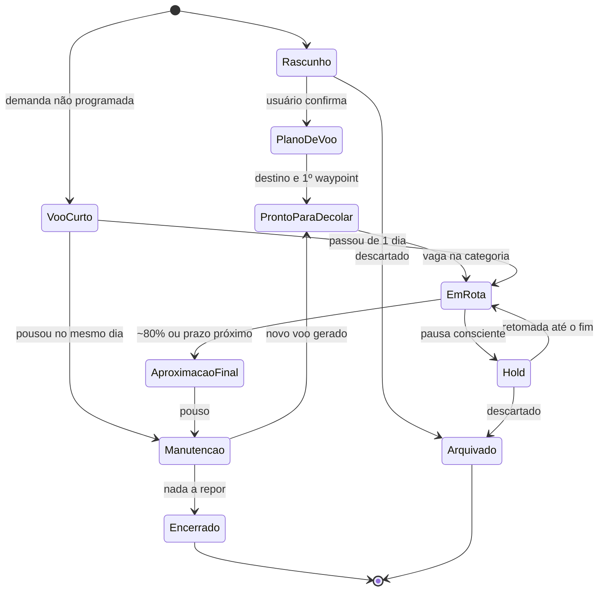
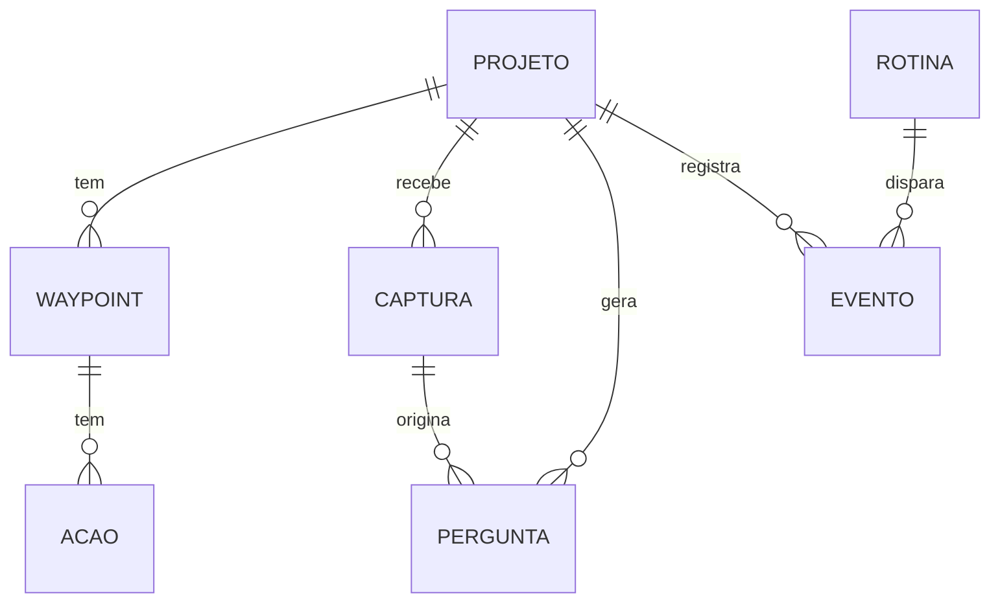
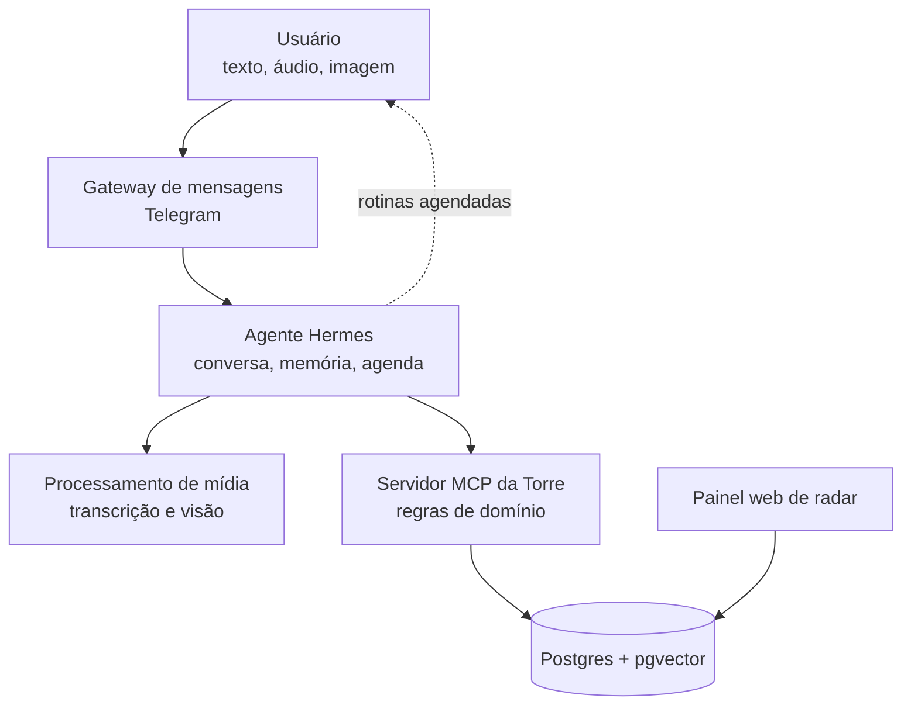

# BFFD — Projeto Conceitual

Sep 24, 2026 · @Sergio

## 1. Visão e propósito

O BFFD (Bring the Flights to Final Destination) é um conselheiro virtual, disponível 24 horas, que ajuda uma pessoa com TDAH a levar projetos pessoais e profissionais até o fim. A torre é operada pela agente Bia Torres, a controladora de tráfego que conversa com o usuário num tom super informal, despojado e bem-humorado. No modo turbulência, o humor fica mais leve e o acolhimento vem primeiro. O objetivo central é aumentar a taxa de projetos concluídos, não a quantidade de tarefas registradas.

**Método de base.** A Bia orienta o piloto com as direções do método *Getting Things Done* (GTD), de David Allen: capturar, esclarecer, organizar, refletir e engajar, traduzidas para a linguagem de aviação e adaptadas para TDAH.

**Problema.** Pessoas com TDAH começam muitos projetos e perdem o estímulo antes de concluí-los. Cada abandono gera frustração, e a frustração acumulada leva a estados de paralisia que atrasam ainda mais tudo. As ferramentas tradicionais pioram o ciclo: exigem disciplina para serem usadas e exibem listas de atraso que reforçam a culpa.

**Para quem.** Usuário único na primeira versão: o próprio autor, desenvolvedor de sistemas com TDAH, que conduz vários projetos em paralelo e registra ideias em texto, áudio e imagem ao longo do dia.

**Metáfora de operação.** Cada projeto é uma aeronave em voo. A torre, na voz de Bia Torres, acompanha todas as aeronaves no radar, mantém cada uma na rota, avisa sobre desvios e, quando um voo se aproxima do destino, conduz a aproximação final até o pouso. O usuário pilota; a torre orienta, lembra e organiza.

**Proposta de valor em uma frase:** capturar tudo sem atrito, mostrar sempre um único próximo passo e conduzir cada projeto até o pouso.

## 2. Princípios de design

Oito princípios orientam todas as decisões de produto. Quando uma funcionalidade conflitar com eles, os princípios vencem.

1. **Captura sem atrito.** Registrar algo deve levar menos de 10 segundos, por texto, áudio ou foto. Organizar é trabalho do sistema, não do usuário.
2. **Uma coisa por vez.** A interface principal mostra um único voo e uma única próxima ação. Listas completas só aparecem quando pedidas.
3. **Poucos voos no ar.** Até 3 voos ativos: 2 profissionais e 1 pessoal. Para decolar um novo na mesma categoria, outro precisa pousar ou entrar em hold. Voos em preparação e em hold são ilimitados, mas monitorados.
4. **Progresso visível.** Todo marco precisa ser algo que se possa ver, mostrar ou usar. Concluir um marco gera reconhecimento explícito.
5. **Reentrada sem culpa.** Após qualquer período de ausência, o sistema recebe o usuário com contexto e um passo pequeno, nunca com uma lista de atrasos.
6. **A torre vai até o piloto.** O sistema é proativo: inicia conversas, faz briefings e lembra do que importa, sem depender da memória do usuário.
7. **Perguntar em vez de adivinhar.** Quando houver dúvida sobre onde uma informação se encaixa, o sistema pergunta, com opções prontas para tocar. A captura é salva mesmo sem resposta.
8. **Cuidado antes de cobrança.** Sinais de desânimo ou ausência prolongada reduzem a exigência em vez de aumentá-la.

**O GTD como alicerce.** Os princípios acima aplicam o GTD ao cérebro com TDAH. A Bia usa as perguntas do método em cada conversa (exige ação? qual o resultado desejado? qual a próxima ação física? leva menos de 2 minutos?), mantém as listas do GTD (próximas ações por contexto, aguardando, algum dia/talvez) e conduz a revisão semanal. Onde o GTD original e o BFFD divergem, como no limite de voos ativos, prevalece a regra do BFFD. O detalhamento está na seção 5.6 do [PRD](https://claude.ai/code/artifact/b87b2a9d-36b4-435a-afce-584659bfc2e7).

## 3. Glossário

A metáfora de aviação é também a linguagem ubíqua do domínio: os mesmos termos aparecem na interface, nas conversas do agente e no código.

| Termo | Significado no sistema |
| --- | --- |
| BFFD | Bring the Flights to Final Destination: o nome do sistema |
| Bia Torres | Agente controladora de tráfego; a voz do sistema nas conversas |
| Voo | Um projeto em acompanhamento, profissional ou pessoal |
| Plano de voo | Definição do projeto: destino, motivo, prazo e marcos |
| Destino | Critério objetivo de conclusão do projeto ("definição de pronto") |
| Waypoint | Marco intermediário tangível, de 1 a 2 semanas |
| Próxima ação | Passo físico de 15 a 45 minutos que move o voo |
| Radar | Conjunto de todas as capturas recebidas |
| Captura | Qualquer entrada do usuário: texto, áudio ou imagem |
| Tráfego não identificado | Captura que parece indicar um projeto ainda não cadastrado |
| Em preparação | Voo ainda em solo, sendo definido ou pronto para decolar |
| Voo ativo | Voo em rota ou em aproximação final; conta para o limite de 3 |
| Voo curto | Voo não programado, mas necessário, de no máximo 1 dia (até 2 por dia); se passar disso, vira voo ativo |
| Hold | Voo pausado conscientemente, em espera para retomada |
| Aproximação final | Fase dos últimos \~20% do projeto, com foco em concluir |
| Pouso | Projeto concluído segundo seu destino |
| Pouso parcial | Conclusão de uma versão reduzida, registrada como entrega válida |
| Manutenção | Fase após o pouso, com passageiros ainda a bordo: repor o que foi consumido, revisar a entrega e preparar novos voos, curtos ou ativos; sem prazo para encerrar |
| Caixa-preta | Registro cronológico de todos os eventos de um voo |
| Briefing | Mensagem proativa com o voo e a próxima ação do momento |
| Turbulência | Sinal de baixa energia ou sobrecarga detectado pelo sistema |

## 4. Escopo funcional

O sistema tem oito módulos. Os módulos M1 a M4 e M6 formam o núcleo; M5, M7 e M8 completam a experiência.

### M1. Captura multimodal

- Receber texto, áudio e imagem pelo canal de mensagens (Telegram na primeira versão).
- Transcrever áudios e descrever imagens, preservando sempre o arquivo original.
- Confirmar o recebimento em uma linha, sem exigir nenhuma ação do usuário.
- Aceitar também um formulário web para cadastro formal de projetos.

### M2. Roteamento de contexto

- Identificar a qual projeto cada captura pertence, com um nível de confiança.
- Confiança alta: vincular e avisar. Confiança média: perguntar com opções. Confiança baixa: manter na caixa de entrada.
- Classificar o tipo da captura: ideia, tarefa, decisão, referência, bloqueio ou progresso.
- Aprender com as correções do usuário para melhorar os próximos vínculos.

### M3. Detecção e definição progressiva de projetos

- Reconhecer em conversas e capturas a intenção de realizar algo novo (tráfego não identificado).
- Criar um projeto em estágio Rascunho e sugerir ao usuário confirmá-lo.
- Completar o plano de voo aos poucos, com no máximo uma pergunta por interação, até ter destino, motivo, primeiro waypoint e próxima ação.

### M4. Priorização e controle de tráfego

- Sugerir a ordem dos voos com base em impacto, urgência, energia exigida e proximidade do pouso.
- Aplicar o limite de voos ativos por categoria: 2 profissionais e 1 pessoal.
- Manter ilimitados os voos em preparação e em hold, sem que ocupem vaga ativa.
- Registrar voos curtos: demandas não programadas, mas necessárias, de no máximo 1 dia e até 2 por dia. Se não pousarem no mesmo dia, viram voos ativos.
- Conduzir a retomada de um voo em hold até o fim quando abrir vaga na sua categoria.
- Registrar a prioridade final como decisão do usuário.

### M5. Metas e waypoints

- Ajudar a formular o destino como critério verificável.
- Quebrar o caminho em waypoints tangíveis e cada waypoint em próximas ações pequenas.
- Validar cada waypoint pelo teste "dá para ver, mostrar ou usar?".
- Celebrar a conclusão de waypoints e registrar na caixa-preta.

### M6. Rotinas proativas

- Briefing às 9h: um voo e uma próxima ação.
- Check-in às 14h: como está o voo do dia, em uma pergunta.
- Debriefing às 19h: o que andou, sem julgamento.
- As três rotinas acontecem só em dias úteis; nos fins de semana, a torre só fala se o piloto chamar.
- Revisão semanal guiada para ajustar prioridades e decidir pousos, holds e manutenções.
- Sessões de foco acompanhadas (body doubling virtual) sob demanda.

### M7. Aproximação final

- Ativar automaticamente quando o projeto passar de \~80% dos waypoints ou se aproximar do prazo.
- Desviar novas ideias sobre o projeto para um backlog pós-pouso.
- Gerar um checklist de pouso só com o que falta.
- Oferecer o pouso parcial como forma válida de concluir.

### M8. Modo turbulência

- Detectar dois tipos de sinal: afastamento (o usuário sumiu) e sobrecarga (há voos demais parados).
- Suspender cobranças e oferecer um passo de até 2 minutos, ou apenas perguntar como o usuário está.
- Diante de sobrecarga, propor uma triagem curta: escolher o que volta a voar, o que segue em hold e o que é arquivado.
- Se o padrão persistir, sugerir contato com uma pessoa de confiança ou profissional de saúde.
- Acolher a volta do usuário com um resumo de onde cada voo parou.

| Sinal | Tipo | Limiar |
| --- | --- | --- |
| Dias sem interação com voos ativos | Afastamento | Leve: 1 a 3 dias; moderada: 4 a 7; forte: 8 ou mais (dias corridos) |
| Voo em hold sem interação sobre sua situação | Afastamento | Mais de 15 dias |
| Voos ativos acima do limite | Sobrecarga | Mais de 5 dias acima de 2 profissionais ou 1 pessoal |
| Voos em preparação | Sobrecarga | Mais de 5 |
| Voos em hold | Sobrecarga | Mais de 10 |
| Linguagem de desânimo nas mensagens | Complementar | Qualquer ocorrência, sempre com resposta acolhedora |

## 5. Fora do escopo

Os itens abaixo ficam deliberadamente de fora, para proteger o foco do próprio projeto.

- **Tratamento ou diagnóstico.** O sistema é uma ferramenta de organização, não substitui acompanhamento médico ou psicológico.
- **Uso por equipes e múltiplos usuários.** A primeira versão atende uma única pessoa.
- **Gestão de projetos corporativa.** Sem Gantt, alocação de recursos, orçamento ou controle de horas.
- **Integrações de escrita em ferramentas externas** (Jira, Trello, Notion, calendário). Podem entrar depois; no início o sistema é a fonte da verdade.
- **Aplicativo móvel nativo.** O canal de mensagens cumpre esse papel.
- **Gamificação competitiva** (rankings, pontos trocáveis). O reconhecimento é pessoal e ligado a progresso real.
- **Execução autônoma de tarefas do projeto** pelo agente, como escrever código ou enviar e-mails em nome do usuário.

## 6. Ciclo de vida do projeto

Os voos se dividem em cinco grupos: em preparação, curtos, ativos, em hold e pós-pouso. Só os ativos (Em rota e Aproximação final) contam para o limite de 2 profissionais e 1 pessoal. Um voo curto que não pousa no mesmo dia vira ativo, e ficar acima do limite por mais de 5 dias gera turbulência.

| Grupo | Estágio | Condição de entrada | Papel da torre |
| --- | --- | --- | --- |
| Em preparação | Rascunho | Projeto detectado ou cadastrado | Perguntar se é um projeto real e de qual categoria |
| Em preparação | Plano de voo | Usuário confirmou | Completar destino, motivo e prazo |
| Em preparação | Pronto para decolar | Destino e primeiro waypoint definidos | Aguardar vaga na categoria |
| Curto | Voo curto | Demanda não programada, mas necessária | Resolver no mesmo dia; se passar, converter em voo ativo |
| Ativo | Em rota | Vaga na categoria ou voo curto que passou de 1 dia | Briefings, próximas ações, check-ins |
| Ativo | Aproximação final | \~80% dos waypoints ou prazo próximo | Checklist de pouso, bloqueio de escopo |
| Hold | Hold | Pausa consciente do usuário | Guardar contexto; perguntar sobre a situação antes de 15 dias |
| Pós-pouso | Manutenção | Destino ou pouso parcial atingido | Celebrar, medir o que repor, revisar a entrega e preparar novos voos |
| Pós-pouso | Encerrado | Manutenção concluída sem pendências | Guardar histórico e aprendizados |
| Pós-pouso | Arquivado | Decisão de descartar | Guardar histórico, sem cobrança |

## 7. Modelo de domínio conceitual

O domínio gira em torno de Projeto; Captura é a porta de entrada de tudo e Evento é a memória de tudo.

| Entidade | Responsabilidade | Atributos principais |
| --- | --- | --- |
| Projeto | Um voo acompanhado | nome, categoria (profissional ou pessoal), estágio, destino, motivo, prazo, prioridade, energia exigida, embedding, data da última interação |
| Waypoint | Marco tangível | título, critério de pronto, ordem, status, data de conclusão |
| Ação | Próximo passo físico | descrição, estimativa em minutos, status, contexto (local, ferramenta) |
| Captura | Entrada bruta do usuário | tipo de mídia, conteúdo original, transcrição, classificação, projeto, confiança |
| Pergunta | Dúvida pendente da torre | texto, opções, origem, prioridade, resposta |
| Evento | Caixa-preta | tipo, projeto, data e hora, dados |
| Rotina | Interação agendada | tipo (briefing, check-in, revisão), agenda, última execução |
| Perfil | Preferências do usuário | horários das rotinas (9h, 14h, 19h), limites por categoria (2 profissionais, 1 pessoal), limiares de turbulência, persona da agente |

Regra de integridade: nenhuma captura é descartada. Uma captura sem projeto permanece na caixa de entrada até ser vinculada ou arquivada pelo usuário.

## 8. Arquitetura conceitual e stack candidata

A arquitetura separa o agente conversacional (Hermes) da lógica de domínio, que fica num serviço próprio exposto como servidor MCP. Assim o agente pode ser trocado sem reescrever regras de negócio.

| Camada | Responsabilidade | Candidato |
| --- | --- | --- |
| Canal | Receber e enviar mensagens, áudios e imagens | Telegram Bot API; WhatsApp em fase futura |
| Agente | Conversa, memória, agendamento das rotinas | Hermes Agent (Nous Research) |
| Mídia | Transcrição de áudio, descrição de imagens | Whisper; modelo com visão |
| Domínio | Roteamento, estágios, prioridade, limites, regras | Servidor MCP próprio (TypeScript ou Python) |
| Dados | Persistência e busca semântica | Supabase (Postgres + pgvector) |
| Visualização | Radar de voos, caixa de entrada, caixa-preta | Painel web (Next.js) |

Ferramentas MCP iniciais: `registrar_captura`, `vincular_captura`, `criar_candidato`, `atualizar_plano_de_voo`, `listar_voos`, `proxima_acao`, `registrar_progresso`, `perguntas_pendentes`, `gerar_briefing`.

As capacidades do Hermes Agent (gateway, memória, agendamento) devem ser confirmadas na documentação atual antes de fechar a arquitetura.

## 9. Fases de entrega

O MVP deve caber em dois fins de semana e passar a controlar o próprio desenvolvimento do sistema a partir da primeira semana de uso.

| Fase | Destino (definição de pronto) | Módulos |
| --- | --- | --- |
| 0. MVP | Bot recebe texto e áudio, salva capturas, vincula a projetos cadastrados à mão e envia briefing matinal com uma próxima ação | M1 (parcial), M2 (parcial), M6 (briefing) |
| 1. Radar | Roteamento automático com perguntas, imagens, waypoints e limite de voos ativos | M1, M2, M4, M5 |
| 2. Torre | Detecção de projetos novos, definição progressiva, voos curtos, check-ins e revisão semanal | M3, M6 |
| 3. Aproximação | Modo aproximação final, pouso parcial e modo turbulência | M7, M8 |
| 4. Painel | Painel web com todos os voos (ativos, em preparação, em hold e pousados em manutenção), caixa de entrada e caixa-preta | Visualização |

Cada fase é tratada como um voo dentro do próprio sistema: só a fase atual fica em rota, e a próxima só decola quando a anterior pousar.

## 10. Critérios de sucesso e métricas

O sistema tem sucesso se, após 3 meses de uso, o usuário tiver pousado mais projetos do que abandonado. As metas numéricas abaixo são pontos de partida e devem ser recalibradas após o primeiro mês.

| Métrica | Como medir | Meta inicial |
| --- | --- | --- |
| Projetos pousados | Voos que chegaram a Pousado ou pouso parcial por trimestre | Pelo menos 2 |
| Waypoints concluídos | Waypoints concluídos por semana | Pelo menos 1 |
| Tempo de captura | Do envio à confirmação do sistema | Menos de 10 s |
| Precisão do roteamento | Capturas vinculadas sem correção do usuário | Acima de 80% |
| Engajamento com briefings | Briefings respondidos ou com ação iniciada | Acima de 60% |
| Reentrada | Dias entre um período de ausência e a retomada de uma ação | Tendência de queda |
| Voos abandonados sem decisão | Voos em hold há mais de 15 dias sem interação sobre sua situação | Zero |

## 11. Riscos, premissas e questões em aberto

O maior risco é o próprio projeto virar mais um voo sem pouso; a mitigação é o MVP enxuto e o uso do sistema para controlar a si mesmo.

### Riscos

| Risco | Impacto | Mitigação |
| --- | --- | --- |
| Escopo crescer antes do MVP pousar | Projeto abandonado | Fases rígidas; ideias novas vão para o backlog pós-pouso |
| Notificações virarem ruído e serem ignoradas | Perda de engajamento | Poucas mensagens, horários ajustáveis, uma ação por mensagem |
| Roteamento errado gerar desconfiança | Usuário volta a organizar à mão | Perguntar na dúvida; correção em um toque; aprendizado com correções |
| Tom de cobrança reforçar culpa | Piora do ciclo de frustração | Princípio 8 e modo turbulência desde as primeiras fases |
| Dados pessoais sensíveis (saúde, humor) | Risco de privacidade | Armazenamento próprio, acesso restrito, sem compartilhamento externo |
| Custo de APIs de modelos e transcrição | Custo mensal alto | Modelos menores para classificação; limite de uso monitorado |

### Premissas

- O usuário usa Telegram diariamente e aceita receber mensagens proativas.
- O Hermes Agent oferece gateway, memória e agendamento suficientes para o MVP.
- Um único usuário justifica uma arquitetura simples, sem multitenancy.

### Decisões tomadas

| Tema | Decisão |
| --- | --- |
| Canal principal | Telegram; WhatsApp em fase futura |
| Limite de voos ativos | 3 voos: 2 profissionais e 1 pessoal |
| Voos em preparação e em hold | Ilimitados, mas monitorados pelo modo turbulência |
| Voos curtos | Voos não programados, mas necessários, de no máximo 1 dia e até 2 por dia; depois disso viram voos ativos |
| Excesso de voos ativos | Acima do limite por mais de 5 dias gera turbulência |
| Horários das rotinas | Briefing às 9h, check-in às 14h, debriefing às 19h, só em dias úteis |
| Fins de semana | A torre só fala se o piloto chamar |
| Turbulência por afastamento | 1 a 3 dias sem interação: leve; 4 a 7: moderada; 8 ou mais: forte (dias corridos, fins de semana incluídos) |
| Outros sinais de turbulência | Hold há mais de 15 dias sem interação; mais de 5 voos em preparação; mais de 10 voos em hold |
| Manutenção | Fase pós-pouso: repor o que foi consumido, revisar a entrega e preparar novos voos, sem prazo para encerrar |
| Painel web | Mostra todos os voos: ativos, em preparação, em hold e em manutenção |
| Nome e persona | BFFD (Bring the Flights to Final Destination), operado pela agente Bia Torres |
| Tom da Bia Torres | Super informal, despojada e bem-humorada |

### Questões em aberto

Nenhuma questão em aberto no momento. O escopo conceitual está fechado para iniciar a Fase 0 (MVP).
